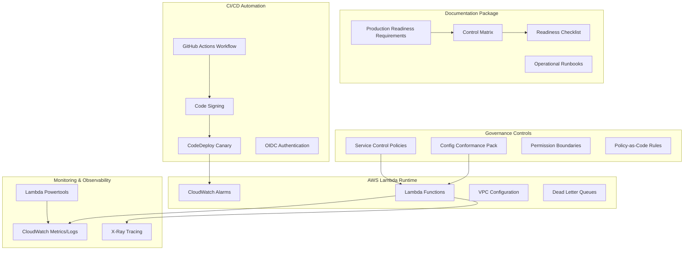

# Design Document: Lambda Production Readiness Requirements

## Overview

This design outlines a comprehensive Production Readiness Requirements (PRR) package for AWS Lambda serverless workloads in regulated financial services environments. The solution provides a structured approach to ensure Lambda-based systems meet production-grade standards through documentation, automation, and governance controls.

The design follows a layered approach:
- **Documentation Layer**: Structured requirements, control matrices, and operational procedures
- **Governance Layer**: Policy-as-code guardrails and compliance frameworks
- **Automation Layer**: CI/CD workflows and monitoring systems
- **Operations Layer**: Runbooks, checklists, and incident response procedures

## Architecture

### High-Level Architecture



### Security Architecture

The security design implements defense-in-depth with multiple control layers:

1. **Identity & Access Management**
   - IAM roles with least-privilege principles
   - Permission boundaries for CI/CD roles
   - OIDC-based authentication (no long-lived keys)
   - AWS IAM Identity Center integration

2. **Code Integrity**
   - AWS Signer for Lambda code signing
   - Mandatory signature verification before deployment
   - Artifact integrity validation in CI/CD pipeline

3. **Network Security**
   - VPC-attached Lambdas for private resource access
   - VPC endpoints for AWS services (avoid NAT gateway costs)
   - Security groups with minimal required access
   - AWS WAF protection for internet-facing APIs

4. **Data Protection**
   - KMS CMKs for environment variable encryption
   - Secrets Manager for sensitive configuration
   - TLS encryption for all data in transit
   - Log redaction for PII protection

5. **Security Monitoring & Compliance**
   - AWS Security Hub for centralized security findings aggregation
   - Integration of scan results from CI/CD pipeline (SAST, SCA, policy violations)
   - GuardDuty, Config, and Inspector findings consolidated in Security Hub
   - Automated compliance reporting and security posture dashboards

## Components and Interfaces

### 1. Production Readiness Requirements Document

**Purpose**: Central documentation defining all production standards

**Structure**:
- Non-Functional Requirements (NFRs)
- Security Baseline
- Lambda Runtime & Reliability
- Event Sources & API Configuration
- Data Protection
- Observability & Operations
- CI/CD Controls
- Change & Release Management
- Cost & FinOps
- Compliance Mapping

**Interface**: Markdown document with structured sections and cross-references

### 2. Control Matrix

**Purpose**: Maps requirements to AWS services and evidence artifacts

**Schema**:
```
| Requirement | AWS Service/Feature | How Enforced/Configured | Automated Check/Test | Evidence Artifact |
```

**Coverage Areas**:
- Identity management (40+ controls)
- Code signing and integrity
- Secrets and key management
- Network and VPC controls
- API throttling and protection
- Version and concurrency management
- Observability and monitoring
- Disaster recovery procedures

### 3. Guardrails as Code

**Components**:

a) **Service Control Policies (SCPs)**
```json
{
  "Version": "2012-10-17",
  "Statement": [
    {
      "Effect": "Deny",
      "Action": "lambda:UpdateFunctionCode",
      "Resource": "*",
      "Condition": {
        "Null": {
          "lambda:CodeSigningConfigArn": "true"
        }
      }
    }
  ]
}
```

b) **AWS Config Conformance Pack**
- Managed rules: `lambda-function-settings-check`, `lambda-inside-vpc`
- Custom rules: `cmk-backing-lambda-env-vars`, `api-gw-waf-associated`

c) **CI/CD Policy Checks**
- Checkov for IaC security scanning
- terraform-compliance for policy validation
- CodeQL for code security analysis
- Dependabot for dependency management

### 4. Operational Runbooks

**Structure**: Step-by-step procedures for common scenarios

**Runbook Categories**:
- Incident Response (5XX errors, throttling, DLQ issues)
- Maintenance (secret rotation, runtime upgrades)
- Deployment (canary rollouts, rollbacks)
- Monitoring (alarm investigation, log analysis)

**Format**: Bulleted procedures with decision trees and Mermaid diagrams

### 5. CI/CD Workflow

**Pipeline Stages**:
1. **Lint & Test**: Code quality and unit testing
2. **Security Scan**: SAST, SCA, and policy validation with results sent to AWS Security Hub
3. **Build & Package**: Artifact creation and optimization
4. **Sign**: AWS Signer code signing
5. **Deploy**: CodeDeploy canary deployment
6. **Verify**: Health checks and rollback triggers

**Authentication**: GitHub OIDC with AWS IAM roles
**Deployment Strategy**: Blue/green with Lambda aliases
**Rollback**: Automated based on CloudWatch alarms

## Data Models

### Control Matrix Entry
```typescript
interface ControlMatrixEntry {
  requirement: string;
  awsService: string;
  enforcement: string;
  automatedCheck: string;
  evidenceArtifact: string;
  complianceMapping?: string[];
}
```

### Runbook Procedure
```typescript
interface RunbookProcedure {
  title: string;
  scenario: string;
  steps: RunbookStep[];
  escalation: EscalationPath;
  mermaidDiagram?: string;
}

interface RunbookStep {
  action: string;
  command?: string;
  expectedResult: string;
  troubleshooting?: string;
}
```

### Checklist Item
```typescript
interface ChecklistItem {
  category: string;
  requirement: string;
  validation: string;
  evidenceLink: string;
  mandatory: boolean;
}
```

## Error Handling

### CI/CD Pipeline Errors
- **Build Failures**: Fail fast with clear error messages
- **Security Scan Failures**: Block deployment on HIGH/CRITICAL findings, send results to AWS Security Hub for centralized security monitoring
- **Code Signing Failures**: Prevent unsigned code deployment
- **Deployment Failures**: Automatic rollback to previous version

### Runtime Error Handling
- **Lambda Timeouts**: Configured based on load testing
- **Memory Errors**: Right-sizing recommendations
- **Throttling**: Reserved/provisioned concurrency configuration
- **DLQ Processing**: Automated retry with exponential backoff

### Monitoring and Alerting
- **CloudWatch Alarms**: Error rates, duration, throttles
- **X-Ray Tracing**: End-to-end request tracking
- **Log Analysis**: Structured logging with correlation IDs
- **Incident Response**: Automated escalation procedures

## Testing Strategy

### Documentation Testing
- **Requirement Validation**: Ensure all acceptance criteria are testable
- **Control Matrix Verification**: Validate AWS service mappings
- **Runbook Testing**: Simulate incident scenarios
- **Checklist Validation**: Verify evidence artifact accessibility

### Policy Testing
- **SCP Validation**: Test policy enforcement in sandbox environment
- **Config Rule Testing**: Validate custom rule logic
- **Permission Boundary Testing**: Verify CI/CD role restrictions
- **IaC Policy Testing**: Automated policy compliance checks

### Workflow Testing
- **CI/CD Pipeline Testing**: End-to-end workflow validation
- **Code Signing Testing**: Verify signature enforcement
- **Deployment Testing**: Canary deployment scenarios
- **Rollback Testing**: Automated and manual rollback procedures

### Integration Testing
- **AWS Service Integration**: Validate service configurations
- **Monitoring Integration**: Test alarm and notification flows
- **Compliance Integration**: Verify audit trail completeness
- **Security Integration**: End-to-end security control validation

## Implementation Approach

### Phase 1: Core Documentation
1. Create PRR document structure
2. Develop control matrix framework
3. Define compliance mappings
4. Establish evidence collection methods

### Phase 2: Governance Implementation
1. Implement Service Control Policies
2. Create AWS Config conformance pack
3. Develop permission boundaries
4. Set up policy-as-code validation

### Phase 3: Automation & CI/CD
1. Create GitHub Actions workflow
2. Implement code signing integration
3. Set up CodeDeploy canary deployments
4. Configure monitoring and alerting

### Phase 4: Operations & Runbooks
1. Develop incident response procedures
2. Create maintenance runbooks
3. Implement production readiness checklist
4. Set up operational dashboards

### Phase 5: Validation & Testing
1. Test all guardrails and policies
2. Validate CI/CD workflows
3. Conduct runbook simulations
4. Perform compliance audit preparation