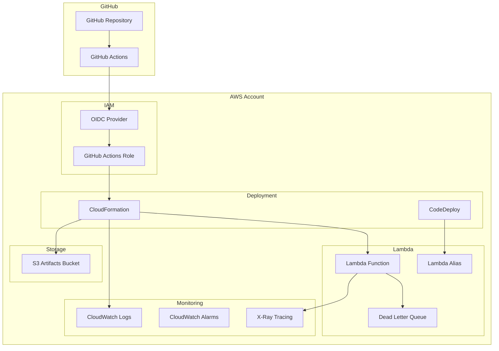
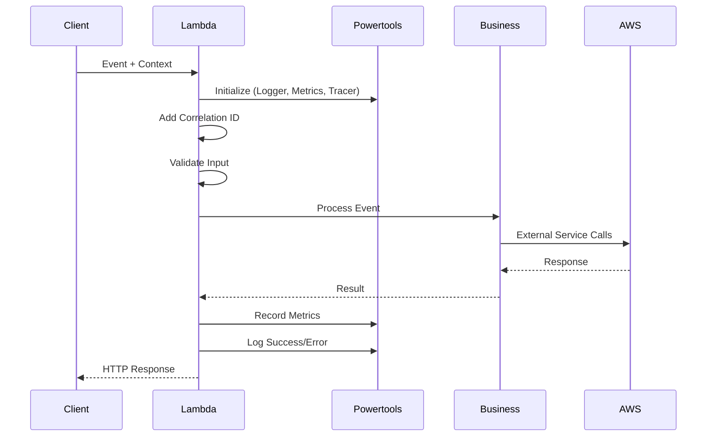
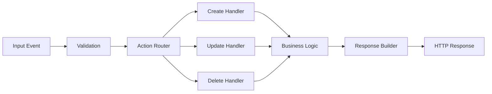
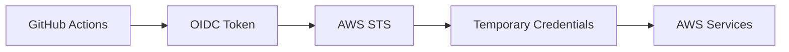
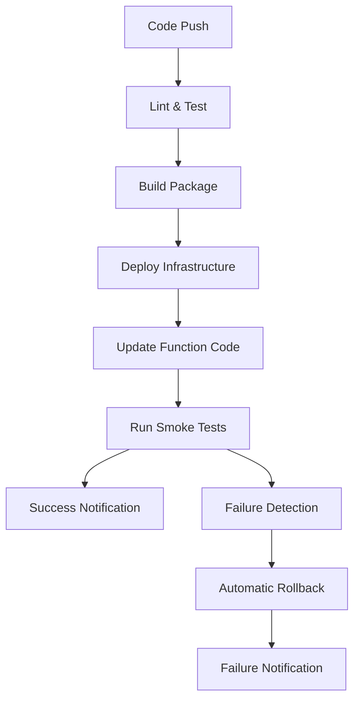

# Architecture Documentation

This document describes the technical architecture, design decisions, and infrastructure components of the Lambda application.

## System Overview

### High-Level Architecture



### Technology Stack

| Layer | Technology | Purpose |
|-------|------------|---------|
| **Runtime** | Node.js 22.x | Lambda execution environment |
| **Language** | TypeScript | Type-safe development |
| **Framework** | AWS Lambda Powertools | Observability and best practices |
| **Infrastructure** | CloudFormation | Infrastructure as Code |
| **CI/CD** | GitHub Actions | Automated deployment pipeline |
| **Authentication** | OIDC | Secure GitHub-to-AWS authentication |
| **Monitoring** | CloudWatch + X-Ray | Logging, metrics, and tracing |

## Infrastructure Components

### Core Lambda Infrastructure

#### Lambda Function
```yaml
Type: AWS::Lambda::Function
Properties:
  Runtime: nodejs22.x
  Handler: dist/index.handler
  MemorySize: 256MB (staging) / 512MB (production)
  Timeout: 30 seconds
  Environment:
    Variables:
      ENVIRONMENT: staging/production
      LOG_LEVEL: debug/info
```

**Key Features:**
- **TypeScript compilation** to JavaScript
- **AWS Lambda Powertools** integration
- **Environment-specific configuration**
- **X-Ray tracing** enabled
- **Dead letter queue** for failed invocations

#### IAM Execution Role
```yaml
Type: AWS::IAM::Role
Policies:
  - AWSLambdaBasicExecutionRole  # CloudWatch Logs
  - AWSXRayDaemonWriteAccess     # X-Ray tracing
  - Custom DLQ policy            # SQS send message
```

**Security Principles:**
- **Least privilege** access
- **Resource-specific** permissions
- **Environment isolation**

#### Dead Letter Queue
```yaml
Type: AWS::SQS::Queue
Properties:
  MessageRetentionPeriod: 14 days
  VisibilityTimeoutSeconds: 30
```

**Purpose:**
- **Failed invocation** handling
- **Error analysis** and debugging
- **Message replay** capability

### Storage Infrastructure

#### S3 Artifacts Bucket
```yaml
Type: AWS::S3::Bucket
Properties:
  VersioningConfiguration: Enabled
  BucketEncryption: AES256
  PublicAccessBlock: All blocked
  LifecycleConfiguration:
    - DeleteOldVersions: 30 days
```

**Features:**
- **Versioned deployments** for rollback
- **Encryption at rest**
- **Automatic cleanup** of old artifacts
- **Secure access** (no public access)

### Monitoring Infrastructure

#### CloudWatch Logs
```yaml
LogGroup: /aws/lambda/{function-name}
RetentionInDays: 14 (configurable)
```

**Structured Logging:**
- **JSON format** with correlation IDs
- **Log levels** (DEBUG, INFO, WARN, ERROR)
- **Request/response** tracking
- **Performance metrics**

#### CloudWatch Alarms
```yaml
Alarms:
  - ErrorRate: > 5 errors (staging) / 3 errors (production)
  - Duration: > 10s (staging) / 8s (production)
  - Throttles: >= 1 throttle
```

**Monitoring Strategy:**
- **Proactive alerting** on issues
- **Environment-specific** thresholds
- **Automatic recovery** triggers

#### X-Ray Tracing
```yaml
TracingConfig:
  Mode: Active
```

**Capabilities:**
- **End-to-end** request tracing
- **Performance bottleneck** identification
- **Service map** visualization
- **Error correlation**

### CI/CD Infrastructure

#### GitHub OIDC Provider
```yaml
Type: AWS::IAM::OIDCProvider
Properties:
  Url: https://token.actions.githubusercontent.com
  ClientIdList: [sts.amazonaws.com]
  ThumbprintList: [GitHub certificate thumbprints]
```

**Security Benefits:**
- **No long-lived credentials** in GitHub
- **Short-lived tokens** for each deployment
- **Repository-specific** access control

#### GitHub Actions IAM Roles
```yaml
# Staging Role
GitHubActionsStagingRole:
  Permissions:
    - Lambda: staging resources only
    - S3: staging buckets only
    - IAM: staging roles only
    - CloudFormation: full access
    - CloudWatch: full access

# Production Role  
GitHubActionsProductionRole:
  Permissions: [Similar but for production resources]
```

**Access Control:**
- **Environment isolation** via resource naming
- **Least privilege** for each environment
- **Audit trail** via CloudTrail

#### CodeDeploy Application
```yaml
Type: AWS::CodeDeploy::Application
ComputePlatform: Lambda
DeploymentConfig:
  - Staging: Direct deployment
  - Production: Canary (10% traffic for 5-10 minutes)
```

**Deployment Strategy:**
- **Blue/green deployments** for zero downtime
- **Canary releases** for production safety
- **Automatic rollback** on failures

## Application Architecture

### Lambda Handler Design

#### Request Flow


#### Error Handling Strategy
```typescript
try {
  // Business logic
  const result = await processEvent(event, correlationId);
  
  // Success path
  metrics.addMetric('SuccessCount', MetricUnits.Count, 1);
  return successResponse(result, correlationId);
  
} catch (error) {
  // Error path
  metrics.addMetric('ErrorCount', MetricUnits.Count, 1);
  logger.error('Function failed', { error: error.message, correlationId });
  
  // Don't leak sensitive information
  return errorResponse('Internal server error', correlationId);
}
```

#### Business Logic Separation
```typescript
// Handler (infrastructure concerns)
export const handler = async (event, context) => {
  // Observability setup
  // Input validation
  // Error handling
  // Response formatting
};

// Business logic (pure functions)
async function processEvent(event, correlationId) {
  // Domain-specific logic
  // No AWS SDK calls here
  // Testable in isolation
}

// AWS service interactions (separate layer)
async function saveToDatabase(data) {
  // AWS SDK calls
  // Error handling for AWS services
}
```

### Data Flow Architecture

#### Event Processing


#### Event Structure
```typescript
interface LambdaEvent {
  action: 'create' | 'update' | 'delete';
  data: {
    id?: string;
    name?: string;
    [key: string]: unknown;
  };
  source?: string;
}

interface ProcessResult {
  id: string;
  name?: string;
  status: 'created' | 'updated' | 'deleted';
  timestamp: string;
}
```

## Security Architecture

### Authentication & Authorization

#### GitHub Actions Authentication


**Security Features:**
- **Short-lived tokens** (1 hour max)
- **Repository-specific** access
- **Branch/tag restrictions** possible
- **Audit logging** via CloudTrail

#### Lambda Execution Security
```yaml
ExecutionRole:
  Policies:
    - CloudWatch Logs: Write only
    - X-Ray: Write traces
    - SQS DLQ: Send messages only
  
  # No permissions for:
  # - Reading other Lambda functions
  # - Accessing other AWS services
  # - Cross-account access
```

### Network Security

#### VPC Configuration (Optional)
```yaml
# If VPC is needed for database access
VpcConfig:
  SecurityGroupIds: [sg-lambda-access]
  SubnetIds: [subnet-private-1, subnet-private-2]
```

**Considerations:**
- **Cold start impact** (additional ENI setup time)
- **NAT Gateway costs** for internet access
- **Security group** configuration
- **Subnet planning** for availability

#### API Security (Future Enhancement)
```yaml
# If API Gateway is added
ApiGateway:
  AuthorizationType: AWS_IAM
  Cors: Configured
  Throttling: Enabled
  RequestValidation: Enabled
```

### Data Security

#### Encryption
- **At Rest**: S3 bucket encryption (AES-256)
- **In Transit**: HTTPS for all API calls
- **Logs**: CloudWatch Logs encryption (optional)

#### Secrets Management
```typescript
// For future database credentials
import { SecretsManager } from 'aws-sdk';

const getSecret = async (secretName: string) => {
  const secretsManager = new SecretsManager();
  const result = await secretsManager.getSecretValue({ SecretId: secretName }).promise();
  return JSON.parse(result.SecretString);
};
```

## Performance Architecture

### Memory and CPU Optimization

#### Memory Allocation Strategy
| Environment | Memory | CPU (approx) | Use Case |
|-------------|--------|--------------|----------|
| Staging | 256MB | 0.4 vCPU | Development/testing |
| Production | 512MB | 0.8 vCPU | Production workloads |

**Optimization Process:**
1. **Monitor CloudWatch metrics**
2. **Analyze memory usage patterns**
3. **Adjust based on cost/performance**
4. **Test with realistic payloads**

#### Cold Start Mitigation
```typescript
// Initialize outside handler
const logger = new Logger({ serviceName: 'my-service' });
const metrics = new Metrics({ namespace: 'MyApp' });
const tracer = new Tracer({ serviceName: 'my-service' });

// Minimize imports
import { Logger } from '@aws-lambda-powertools/logger';
// Don't: import * as AWS from 'aws-sdk';
// Do: import { DynamoDB } from 'aws-sdk';
```

### Scalability Design

#### Concurrency Management
```yaml
# Reserved concurrency (optional)
ReservedConcurrencyConfiguration:
  ReservedConcurrency: 100  # Limit concurrent executions

# Provisioned concurrency (for consistent performance)
ProvisionedConcurrencyConfiguration:
  ProvisionedConcurrency: 10  # Pre-warmed instances
```

#### Auto-scaling Considerations
- **Default scaling**: 1000 concurrent executions
- **Burst scaling**: 500-3000 per minute (region dependent)
- **Reserved concurrency**: Limits for cost control
- **Provisioned concurrency**: Eliminates cold starts

## Deployment Architecture

### Multi-Environment Strategy

#### Environment Isolation
```yaml
Environments:
  Staging:
    Purpose: Development and testing
    Resources: Lower-cost configuration
    Deployment: Automatic on main branch
    
  Production:
    Purpose: Live workloads
    Resources: Optimized for performance
    Deployment: Manual approval required
```

#### Resource Naming Convention
```yaml
Resources:
  Lambda: lambda-function-{environment}
  S3: lambda-artifacts-{environment}-{account-id}
  IAM: GitHubActions-Lambda-{Environment}
  CloudWatch: lambda-{metric}-{environment}
```

### Deployment Pipeline Architecture

#### GitHub Actions Workflow


#### Rollback Strategy
```yaml
Rollback Triggers:
  - CloudWatch alarm activation
  - Deployment failure
  - Manual intervention

Rollback Methods:
  - Lambda alias update (immediate)
  - CloudFormation stack rollback
  - Previous version deployment
```

## Monitoring and Observability Architecture

### Three Pillars of Observability

#### 1. Metrics (CloudWatch)
```typescript
// Custom metrics
metrics.addMetric('ProcessedEvents', MetricUnits.Count, 1);
metrics.addMetric('ProcessingDuration', MetricUnits.Milliseconds, duration);
metrics.addMetric('BusinessMetric', MetricUnits.Count, businessValue);
```

#### 2. Logs (CloudWatch Logs)
```typescript
// Structured logging
logger.info('Processing event', {
  correlationId,
  eventType: event.action,
  userId: event.data.userId,
  timestamp: new Date().toISOString()
});
```

#### 3. Traces (X-Ray)
```typescript
// Custom segments
const segment = tracer.getSegment();
const subsegment = segment?.addNewSubsegment('business-logic');

try {
  // Business logic
  subsegment?.addAnnotation('success', true);
} catch (error) {
  subsegment?.addAnnotation('error', true);
  subsegment?.addMetadata('error', { message: error.message });
} finally {
  subsegment?.close();
}
```

### Alerting Strategy
```yaml
Alert Levels:
  P1 (Critical): Function completely down
  P2 (High): Error rate > threshold
  P3 (Medium): Performance degradation
  P4 (Low): Capacity warnings

Notification Channels:
  - CloudWatch Alarms
  - SNS topics (future)
  - Slack integration (future)
```

## Cost Architecture

### Cost Optimization Strategy

#### Lambda Pricing Factors
- **Request charges**: $0.20 per 1M requests
- **Duration charges**: Based on GB-seconds
- **Provisioned concurrency**: Additional cost for pre-warmed instances

#### Cost Control Measures
```yaml
Cost Controls:
  - Reserved concurrency limits
  - Log retention policies (14 days)
  - S3 lifecycle policies (30 days)
  - Right-sized memory allocation
  - Efficient code (shorter duration)
```

#### Monitoring Costs
```bash
# AWS Cost Explorer
aws ce get-cost-and-usage \
  --time-period Start=2024-01-01,End=2024-01-31 \
  --granularity MONTHLY \
  --metrics BlendedCost \
  --group-by Type=DIMENSION,Key=SERVICE
```

## Future Architecture Considerations

### Potential Enhancements

#### 1. API Gateway Integration
```yaml
ApiGateway:
  Type: AWS::ApiGateway::RestApi
  Integration: Lambda Proxy
  Features:
    - Request validation
    - Rate limiting
    - API keys
    - CORS configuration
```

#### 2. Database Integration
```yaml
Database Options:
  - DynamoDB: Serverless NoSQL
  - RDS Proxy: Managed connection pooling
  - Aurora Serverless: Auto-scaling SQL
```

#### 3. Event-Driven Architecture
```yaml
Event Sources:
  - EventBridge: Custom events
  - SQS: Queue processing
  - S3: File processing
  - DynamoDB Streams: Data changes
```

#### 4. Multi-Region Deployment
```yaml
Regions:
  Primary: us-east-1
  Secondary: us-west-2
  
Cross-Region:
  - S3 replication
  - Lambda@Edge
  - Route 53 health checks
```

### Scalability Roadmap

#### Phase 1: Current State
- Single Lambda function
- Basic monitoring
- Manual deployment

#### Phase 2: Enhanced Observability
- Custom dashboards
- Advanced alerting
- Performance optimization

#### Phase 3: Event-Driven
- Multiple event sources
- Async processing
- Event sourcing patterns

#### Phase 4: Microservices
- Function decomposition
- Service mesh
- Distributed tracing

---

**This architecture provides a solid foundation for serverless applications while maintaining flexibility for future growth.** 🏗️