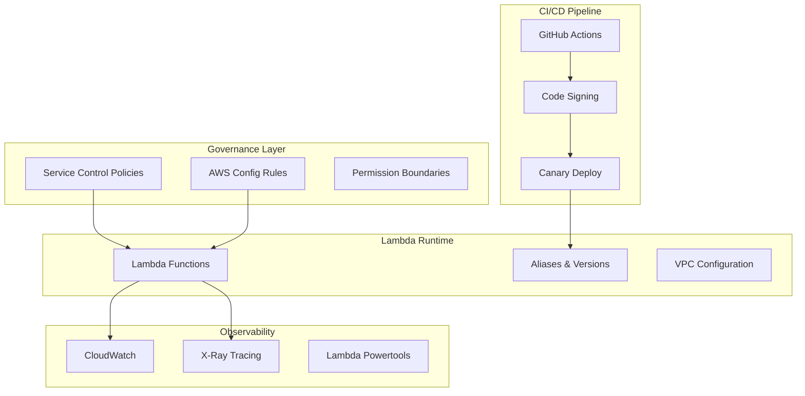

# Lambda Production Readiness Requirements (PRR) Package

A comprehensive production readiness framework for AWS Lambda serverless workloads in regulated financial services environments. This package provides enterprise-grade standards, automated governance, and operational procedures to ensure Lambda systems meet production requirements and pass compliance audits.

## 🚀 Quick Start

1. **Review Requirements**: Start with the [Executive Summary](docs/EXECUTIVE_SUMMARY.md)
2. **Implementation**: Follow the [Implementation Guide](docs/IMPLEMENTATION_GUIDE.md)
3. **Navigation**: Use the [Table of Contents](docs/TABLE_OF_CONTENTS.md) for detailed navigation
4. **Validation**: Complete the [Production Readiness Checklist](docs/checklists/lambda-production-readiness-checklist.md)

## 📋 What's Included

### 📚 Core Documentation
- **Production Readiness Requirements**: Comprehensive NFRs, security baseline, and operational standards
- **Control Matrix**: 40+ mapped controls linking requirements to AWS services with evidence artifacts
- **Implementation Guide**: Step-by-step deployment instructions with code examples
- **Executive Summary**: Business value and implementation approach for leadership

### 🛡️ Policy Guardrails
- **Service Control Policies**: Prevent non-compliant Lambda deployments
- **AWS Config Rules**: Automated compliance monitoring and validation
- **Permission Boundaries**: Secure CI/CD automation with least-privilege access
- **IaC Policy Checks**: Checkov, terraform-compliance, and CodeQL integration

### 🔄 CI/CD Automation
- **GitHub Actions Workflow**: OIDC authentication with secure deployment pipeline
- **Code Signing**: Mandatory AWS Signer integration for Lambda functions
- **Canary Deployments**: CodeDeploy automation with automated rollback
- **Security Scanning**: SAST, SCA, and policy validation with Security Hub integration

### 📖 Operational Runbooks
- **Incident Response**: Step-by-step procedures for Lambda issues (5XX, throttling, DLQ)
- **Maintenance Procedures**: Secret rotation, runtime upgrades, and deployment management
- **Decision Trees**: Mermaid diagrams for troubleshooting and escalation
- **Production Checklist**: Automated validation of all production controls

### 🧪 Testing Framework
- **GitHub Actions & Terraform Testing**: Validate workflow syntax and infrastructure plans (`./scripts/test-github-actions-terraform.sh`)
- **Policy Testing**: Validate SCPs, Config rules, and permission boundaries
- **Workflow Testing**: End-to-end CI/CD pipeline and deployment validation
- **Compliance Testing**: Documentation cross-references and audit trail validation
- **Integration Testing**: Complete solution validation and evidence collection

## 🏗️ Architecture Overview



## 🎯 Compliance Standards

This package supports compliance with:
- **ISO 27001**: Information Security Management
- **SOC 2 Type II**: Security, Availability, and Confidentiality
- **NIST Cybersecurity Framework**: Identify, Protect, Detect, Respond, Recover
- **AWS Well-Architected Framework**: Security, Reliability, Performance, Cost, Operational Excellence
- **Financial Services Regulations**: Industry-specific requirements

## 📊 Key Metrics and KPIs

### Security Posture
- ✅ 100% Lambda functions use code signing
- ✅ Zero high/critical security findings in production
- ✅ All secrets managed through AWS Secrets Manager
- ✅ 100% compliance with permission boundary policies

### Operational Excellence
- ✅ 99.9% availability SLO achievement
- ✅ Mean Time to Recovery (MTTR) < 30 minutes
- ✅ Zero manual deployment processes
- ✅ 100% automated rollback capability

### Compliance & Audit
- ✅ All 40+ controls have automated evidence collection
- ✅ 100% audit trail completeness
- ✅ Zero compliance violations in production
- ✅ Audit-ready documentation and evidence artifacts

## 🚦 Implementation Status

| Phase | Component | Status |
|-------|-----------|--------|
| 1 | Policy Guardrails | ✅ Complete |
| 2 | CI/CD Automation | ✅ Complete |
| 3 | Operational Procedures | ✅ Complete |
| 4 | Testing Framework | ✅ Complete |
| 5 | Documentation Package | ✅ Complete |

## 🛠️ Prerequisites

- AWS Organizations with multi-account setup
- GitHub repository with admin access
- AWS IAM Identity Center configured
- AWS Config and CloudTrail enabled
- Node.js 18+ for Lambda runtime

## 📁 Repository Structure

```
├── docs/                           # Documentation package
│   ├── EXECUTIVE_SUMMARY.md       # Business overview
│   ├── IMPLEMENTATION_GUIDE.md    # Step-by-step instructions
│   ├── TABLE_OF_CONTENTS.md       # Complete navigation
│   ├── prr/                       # Production readiness requirements
│   ├── policies/                  # Policy-as-code guardrails
│   ├── runbooks/                  # Operational procedures
│   ├── checklists/                # Production validation
│   └── diagrams/                  # Architecture diagrams
├── scripts/                       # Automation scripts
├── tests/                         # Comprehensive test suite
└── src/                          # Example Lambda implementation
```

## 🚀 Getting Started

### 1. Review Documentation
```bash
# Start with executive summary
open docs/EXECUTIVE_SUMMARY.md

# Review implementation approach
open docs/IMPLEMENTATION_GUIDE.md
```

### 2. Deploy Policy Guardrails
```bash
# Deploy Service Control Policies
aws organizations attach-policy --policy-id <policy-id> --target-id <ou-id>

# Deploy Config conformance pack
aws configservice put-conformance-pack --conformance-pack-name "LambdaProductionReadiness"
```

### 3. Set up CI/CD Pipeline
```bash
# Configure GitHub OIDC
aws iam create-open-id-connect-provider --url https://token.actions.githubusercontent.com

# Deploy GitHub Actions workflow
cp .github/workflows/lambda-deploy.yml.example .github/workflows/lambda-deploy.yml
```

### 4. Validate Implementation
```bash
# Run production readiness validation
python3 scripts/validate-production-readiness.py

# Execute comprehensive test suite
make test-all
```

## 🧪 Testing

Run the complete test suite to validate all components:

```bash
# Run all tests
make test-all

# Run specific test categories
make test-policies          # Policy guardrails
make test-workflows         # CI/CD workflows  
make test-documentation     # Documentation compliance
```

## 📞 Support and Contribution

### Internal Support
- **Level 1**: Development team leads
- **Level 2**: Platform engineering team  
- **Level 3**: Security and compliance team

### Documentation
- [Implementation Guide](docs/IMPLEMENTATION_GUIDE.md) - Detailed setup instructions
- [Table of Contents](docs/TABLE_OF_CONTENTS.md) - Complete navigation
- [Runbooks](docs/runbooks/) - Operational procedures

## 📄 License

This project is licensed under the MIT License - see the [LICENSE](LICENSE) file for details.

---

**🎯 Ready to deploy enterprise-grade Lambda workloads?** Start with the [Executive Summary](docs/EXECUTIVE_SUMMARY.md) and follow the [Implementation Guide](docs/IMPLEMENTATION_GUIDE.md).
