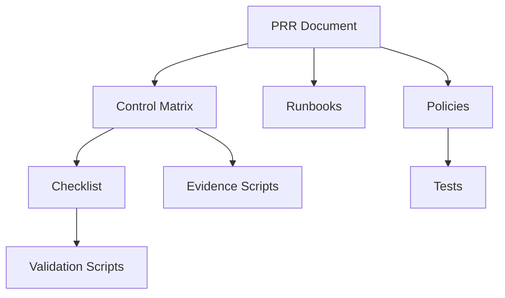
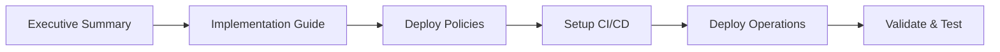
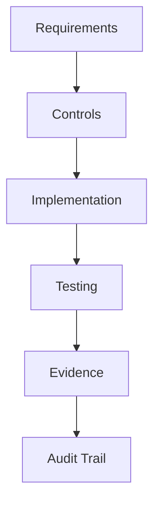

# Lambda PRR Package - Document Index

## Cross-Reference Index

### Requirements to Implementation Mapping

#### Requirement 1: Production Readiness Requirements Document
- **1.1 Non-functional requirements** → [PRR Document](prr/lambda-production-readiness-requirements.md#non-functional-requirements)
- **1.2 Security baseline** → [PRR Document](prr/lambda-production-readiness-requirements.md#security-baseline)
- **1.3 Lambda runtime requirements** → [PRR Document](prr/lambda-production-readiness-requirements.md#lambda-runtime--reliability)
- **1.4 Event sources** → [PRR Document](prr/lambda-production-readiness-requirements.md#event-sources--api-configuration)
- **1.5 Observability requirements** → [PRR Document](prr/lambda-production-readiness-requirements.md#observability--operations)

#### Requirement 2: Control Matrix and Evidence Framework
- **2.1 Control matrix structure** → [Control Matrix](control-matrix.csv)
- **2.2 40+ mapped controls** → [Generated Matrix](control-matrix-generated.csv)
- **2.3 Evidence sources** → [Evidence Generation](../scripts/generate-checklist-evidence.py)
- **2.4 Automated checks** → [Validation Scripts](../scripts/validate-control-matrix.py)

#### Requirement 3: Policy-as-Code Guardrails
- **3.1 Service Control Policies** → [SCP Files](policies/scp-*.json)
- **3.2 AWS Config conformance** → [Config Pack](policies/config-conformance-pack-lambda.yaml)
- **3.3 CI policy checks** → [CI/CD Policies](policies/ci-cd/)
- **3.4 Permission boundaries** → [IAM Boundaries](policies/iam-permission-boundary-*.json)

#### Requirement 4: Operational Runbooks
- **4.1 Incident procedures** → [Lambda Incident Response](runbooks/lambda-incident-response.md)
- **4.2 SQS/DLQ procedures** → [SQS Troubleshooting](runbooks/sqs-dlq-troubleshooting.md)
- **4.3 Secret rotation** → [Secret Rotation Runbook](runbooks/secret-rotation-runtime-upgrade.md)
- **4.4 Runtime upgrades** → [Runtime Upgrade Runbook](runbooks/secret-rotation-runtime-upgrade.md)
- **4.5 Incident flow diagrams** → [Flow Diagrams](runbooks/incident-flow-diagrams.md)

#### Requirement 5: Production Readiness Checklist
- **5.1 Structured checklist** → [Production Checklist](checklists/lambda-production-readiness-checklist.md)
- **5.2 Validation automation** → [Checklist Validation](../scripts/validate-checklist-compliance.py)
- **5.3 Evidence linking** → [Evidence Generation](../scripts/generate-checklist-evidence.py)
- **5.4 Control matrix links** → [Control Matrix](control-matrix.csv)

#### Requirement 6: Reference Architecture Diagrams
- **6.1 Request flow diagrams** → [Lambda Request Flow](diagrams/lambda-request-flow.md)
- **6.2 CI/CD flow** → [CI/CD Pipeline Flow](diagrams/cicd-pipeline-flow.md)
- **6.3 Mermaid format** → All diagram files use Mermaid syntax
- **6.4 Security boundaries** → Included in all architecture diagrams

#### Requirement 7: GitHub Actions CI/CD Workflow
- **7.1 Complete workflow** → [Implementation Guide](IMPLEMENTATION_GUIDE.md#github-actions-workflow-configuration)
- **7.2 OIDC authentication** → [OIDC Setup](IMPLEMENTATION_GUIDE.md#step-21-configure-github-oidc-provider)
- **7.3 Code signing** → [Signing Scripts](../scripts/sign-lambda-package.sh)
- **7.4 Canary deployments** → [Canary Scripts](../scripts/deploy-lambda-canary.sh)
- **7.5 Security scanning** → [Security Hub Integration](../scripts/upload-security-findings.py)

### Control Categories to Implementation

#### Identity and Access Management
- **IAM Execution Roles** → [Permission Boundaries](policies/iam-permission-boundary-lambda-execution.json)
- **Permission Boundaries** → [CI/CD Boundaries](policies/iam-permission-boundary-cicd.json)
- **OIDC Authentication** → [GitHub Actions Setup](IMPLEMENTATION_GUIDE.md#step-21-configure-github-oidc-provider)
- **Identity Center Integration** → [PRR Requirements](prr/lambda-production-readiness-requirements.md#identity--access-management)

#### Code Integrity and Signing
- **Code Signing Policies** → [SCP Code Signing](policies/scp-lambda-code-signing.json)
- **Signing Automation** → [Sign Package Script](../scripts/sign-lambda-package.sh)
- **Signature Validation** → [Custom Config Rule](policies/custom-rules/lambda-code-signing-check.py)
- **Unsigned Code Prevention** → [SCP Enforcement](policies/scp-lambda-code-signing.json)

#### Secrets and Key Management
- **Secrets Manager Integration** → [PRR Requirements](prr/lambda-production-readiness-requirements.md#secrets--key-management)
- **KMS Encryption** → [Custom Config Rule](policies/custom-rules/lambda-cmk-encryption-check.py)
- **Secret Rotation** → [Rotation Runbook](runbooks/secret-rotation-runtime-upgrade.md)
- **Environment Variables** → [Security Baseline](prr/lambda-production-readiness-requirements.md#security-baseline)

#### Network Security and VPC
- **VPC Configuration** → [Config Rules](policies/config-conformance-pack-lambda.yaml)
- **Security Groups** → [PRR Requirements](prr/lambda-production-readiness-requirements.md#network--vpc-controls)
- **VPC Endpoints** → [Implementation Guide](IMPLEMENTATION_GUIDE.md#network-security)
- **WAF Protection** → [API Gateway WAF SCP](policies/scp-api-gateway-waf.json)

#### API Gateway and Event Sources
- **API Gateway Controls** → [WAF Association Check](policies/custom-rules/api-gateway-waf-association-check.py)
- **Throttling Configuration** → [PRR Requirements](prr/lambda-production-readiness-requirements.md#event-sources--api-configuration)
- **EventBridge Integration** → [Event Sources Section](prr/lambda-production-readiness-requirements.md#event-sources--api-configuration)
- **SQS/SNS Configuration** → [DLQ Troubleshooting](runbooks/sqs-dlq-troubleshooting.md)

#### Runtime and Reliability
- **Version Management** → [Canary Deployment](../scripts/deploy-lambda-canary.sh)
- **Concurrency Controls** → [Concurrency Config Rule](policies/custom-rules/lambda-concurrency-validation-check.py)
- **Timeout Configuration** → [PRR Requirements](prr/lambda-production-readiness-requirements.md#lambda-runtime--reliability)
- **DLQ Configuration** → [DLQ Troubleshooting](runbooks/sqs-dlq-troubleshooting.md)

#### Observability and Monitoring
- **CloudWatch Integration** → [Implementation Guide](IMPLEMENTATION_GUIDE.md#step-31-deploy-cloudwatch-alarms)
- **X-Ray Tracing** → [Tracing Config](IMPLEMENTATION_GUIDE.md#step-32-configure-x-ray-tracing)
- **Lambda Powertools** → [Example Implementation](../src/index.js)
- **Structured Logging** → [PRR Requirements](prr/lambda-production-readiness-requirements.md#observability--operations)

#### CI/CD and Deployment
- **GitHub Actions** → [Workflow Configuration](IMPLEMENTATION_GUIDE.md#github-actions-workflow-configuration)
- **CodeDeploy Integration** → [Canary Deployment](../scripts/deploy-lambda-canary.sh)
- **Rollback Procedures** → [Rollback Script](../scripts/rollback-lambda-deployment.sh)
- **Security Scanning** → [Security Hub Integration](../scripts/upload-security-findings.py)

#### Disaster Recovery and Business Continuity
- **Backup Procedures** → [PRR Requirements](prr/lambda-production-readiness-requirements.md#disaster-recovery--business-continuity)
- **Recovery Procedures** → [Incident Response](runbooks/lambda-incident-response.md)
- **RTO/RPO Requirements** → [Non-Functional Requirements](prr/lambda-production-readiness-requirements.md#non-functional-requirements)
- **Cross-Region Setup** → [Implementation Guide](IMPLEMENTATION_GUIDE.md#disaster-recovery)

#### Cost Management and FinOps
- **Cost Controls** → [PRR Requirements](prr/lambda-production-readiness-requirements.md#cost--finops)
- **Resource Optimization** → [Implementation Guide](IMPLEMENTATION_GUIDE.md#cost-optimization)
- **Budget Monitoring** → [CloudWatch Alarms](IMPLEMENTATION_GUIDE.md#step-31-deploy-cloudwatch-alarms)
- **Reserved Concurrency** → [Concurrency Management](prr/lambda-production-readiness-requirements.md#lambda-runtime--reliability)

### Testing Framework to Components

#### Policy Guardrails Testing
- **SCP Testing** → [SCP Enforcement Tests](../tests/policy-guardrails/test_scp_enforcement.py)
- **Config Rules Testing** → [Config Rules Tests](../tests/policy-guardrails/test_config_rules.py)
- **Permission Boundary Testing** → [Permission Boundary Tests](../tests/policy-guardrails/test_permission_boundaries.py)
- **Test Automation** → [Policy Test Runner](../tests/policy-guardrails/test_runner.py)

#### Workflow Integration Testing
- **CI/CD Pipeline Testing** → [Pipeline Tests](../tests/workflow-integration/test_cicd_pipeline.py)
- **Code Signing Testing** → [Code Signing Tests](../tests/workflow-integration/test_code_signing.py)
- **Canary Deployment Testing** → [Canary Tests](../tests/workflow-integration/test_canary_deployment.py)
- **Test Automation** → [Workflow Test Runner](../tests/workflow-integration/test_runner.py)

#### Documentation Compliance Testing
- **Cross-Reference Testing** → [Cross Reference Tests](../tests/documentation-compliance/test_cross_reference_validation.py)
- **Compliance Mapping Testing** → [Compliance Mapping Tests](../tests/documentation-compliance/test_compliance_mapping.py)
- **Audit Trail Testing** → [Audit Trail Tests](../tests/documentation-compliance/test_audit_trail_validation.py)
- **Test Automation** → [Documentation Test Runner](../tests/documentation-compliance/test_runner.py)

## Quick Reference Guides

### By Use Case

#### **New Lambda Function Deployment**
1. [Production Readiness Checklist](checklists/lambda-production-readiness-checklist.md)
2. [GitHub Actions Workflow](IMPLEMENTATION_GUIDE.md#github-actions-workflow-configuration)
3. [Code Signing Setup](../scripts/sign-lambda-package.sh)
4. [Canary Deployment](../scripts/deploy-lambda-canary.sh)

#### **Security Incident Response**
1. [Lambda Incident Response](runbooks/lambda-incident-response.md)
2. [Incident Flow Diagrams](runbooks/incident-flow-diagrams.md)
3. [Security Hub Integration](../scripts/upload-security-findings.py)
4. [Rollback Procedures](../scripts/rollback-lambda-deployment.sh)

#### **Compliance Audit Preparation**
1. [Control Matrix](control-matrix.csv)
2. [Evidence Collection](../scripts/generate-checklist-evidence.py)
3. [Audit Trail Validation](../tests/documentation-compliance/test_audit_trail_validation.py)
4. [Compliance Testing](../tests/documentation-compliance/test_compliance_mapping.py)

#### **Policy Implementation**
1. [Service Control Policies](policies/scp-*.json)
2. [Config Conformance Pack](policies/config-conformance-pack-lambda.yaml)
3. [Permission Boundaries](policies/iam-permission-boundary-*.json)
4. [Policy Testing](../tests/policy-guardrails/)

### By Role

#### **Security Engineers**
- [Security Baseline](prr/lambda-production-readiness-requirements.md#security-baseline)
- [Policy Guardrails](policies/)
- [Security Testing](../tests/policy-guardrails/)
- [Security Hub Integration](../scripts/upload-security-findings.py)

#### **DevOps Engineers**
- [CI/CD Implementation](IMPLEMENTATION_GUIDE.md#phase-2-cicd-pipeline-implementation-week-3-4)
- [Deployment Scripts](../scripts/)
- [Workflow Testing](../tests/workflow-integration/)
- [Pipeline Diagrams](diagrams/cicd-pipeline-flow.md)

#### **Operations Teams**
- [Incident Response](runbooks/lambda-incident-response.md)
- [Troubleshooting](runbooks/sqs-dlq-troubleshooting.md)
- [Maintenance Procedures](runbooks/secret-rotation-runtime-upgrade.md)
- [Production Checklist](checklists/lambda-production-readiness-checklist.md)

#### **Compliance Officers**
- [Control Matrix](control-matrix.csv)
- [Compliance Testing](../tests/documentation-compliance/)
- [Evidence Collection](../scripts/generate-checklist-evidence.py)
- [Audit Procedures](../tests/documentation-compliance/test_audit_trail_validation.py)

## Document Relationships

### Primary Dependencies

### Implementation Flow

### Compliance Traceability

---

**Navigation Tip**: Use Ctrl+F (Cmd+F on Mac) to search for specific requirements, controls, or components within this index.