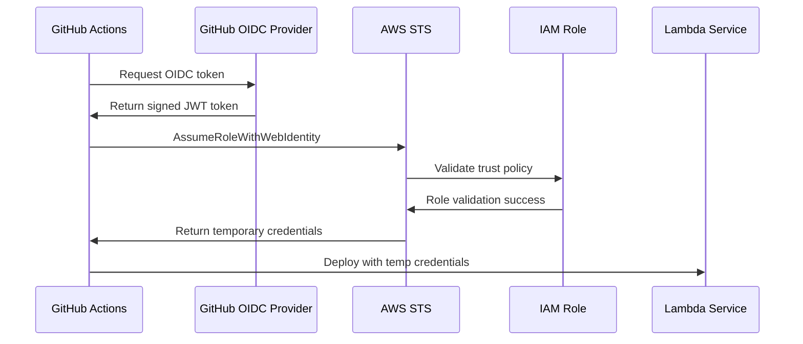

# Production Deployment Guide

This guide provides the recommended production-ready approach for deploying the Lambda serverless application using AWS security best practices.

## 🔐 Security-First Approach

This production setup follows AWS security best practices:

- ✅ **No long-lived access keys** - Uses OIDC for temporary credentials
- ✅ **Least privilege access** - Environment-specific IAM roles
- ✅ **Repository-scoped access** - OIDC trust policies limit access to specific repository
- ✅ **Temporary credentials** - All credentials expire automatically
- ✅ **Audit trail** - All actions logged in CloudTrail

## 🚀 Quick Start (Production Ready)

### Step 1: Set up OIDC Authentication

Run the production OIDC setup script:

```bash
./scripts/setup-production-oidc.sh
```

This script will:
- ✅ Create GitHub OIDC provider in AWS
- ✅ Create environment-specific IAM roles
- ✅ Configure proper trust relationships
- ✅ Attach least-privilege policies
- ✅ Test the configuration

### Step 2: Deploy Using GitHub Actions

Trigger the production-ready workflow:

```bash
# Deploy to staging
gh workflow run "Lambda CI/CD Pipeline (Production Ready)" --field environment=staging

# Deploy to production (after staging approval)
gh workflow run "Lambda CI/CD Pipeline (Production Ready)" --field environment=production
```

## 📋 Prerequisites

### Required Tools

- **AWS CLI** - Latest version with proper authentication
- **GitHub CLI** - For repository management
- **jq** - For JSON processing
- **Node.js 18+** - For Lambda runtime

### AWS Permissions

The user running the setup script needs these IAM permissions:

```json
{
    "Version": "2012-10-17",
    "Statement": [
        {
            "Effect": "Allow",
            "Action": [
                "iam:CreateOpenIDConnectProvider",
                "iam:GetOpenIDConnectProvider",
                "iam:UpdateOpenIDConnectProviderThumbprint",
                "iam:CreateRole",
                "iam:GetRole",
                "iam:AttachRolePolicy",
                "iam:PutRolePolicy",
                "iam:TagRole"
            ],
            "Resource": "*"
        }
    ]
}
```

### Recommended: Use AWS IAM Identity Center

For production environments, use AWS IAM Identity Center (SSO):

```bash
# Configure SSO
aws configure sso

# Use SSO profile
export AWS_PROFILE=your-sso-profile
```

## 🏗️ Architecture Overview

### OIDC Authentication Flow



### IAM Roles Structure

```
├── GitHubActions-Lambda-Staging
│   ├── Trust Policy: GitHub OIDC + Repository scope
│   └── Permissions: PowerUserAccess (staging flexibility)
├── GitHubActions-Lambda-Production  
│   ├── Trust Policy: GitHub OIDC + Repository scope
│   └── Permissions: PowerUserAccess (production deployment)
└── GitHubActions-SecurityScan
    ├── Trust Policy: GitHub OIDC + Repository scope
    └── Permissions: SecurityAudit + ReadOnlyAccess
```

## 🔧 Configuration Details

### OIDC Provider Configuration

- **URL**: `https://token.actions.githubusercontent.com`
- **Audience**: `sts.amazonaws.com`
- **Thumbprints**: GitHub's official OIDC thumbprints
- **Repository Scope**: `repo:snblaise/serverlessapplication:*`

### Trust Policy Example

```json
{
    "Version": "2012-10-17",
    "Statement": [
        {
            "Effect": "Allow",
            "Principal": {
                "Federated": "arn:aws:iam::ACCOUNT:oidc-provider/token.actions.githubusercontent.com"
            },
            "Action": "sts:AssumeRoleWithWebIdentity",
            "Condition": {
                "StringEquals": {
                    "token.actions.githubusercontent.com:aud": "sts.amazonaws.com"
                },
                "StringLike": {
                    "token.actions.githubusercontent.com:sub": "repo:snblaise/serverlessapplication:*"
                }
            }
        }
    ]
}
```

## 🚦 Deployment Workflow

### Staging Deployment

1. **Automatic Triggers**:
   - Push to `develop` branch
   - Pull request to `main` branch
   - Manual workflow dispatch

2. **Pipeline Steps**:
   - ✅ Lint and test code
   - ✅ Security scanning (SAST, SCA, IaC)
   - ✅ Build and package Lambda
   - ✅ Deploy infrastructure with Terraform
   - ✅ Deploy Lambda function
   - ✅ Health checks and verification

### Production Deployment

1. **Triggers**:
   - Push to `main` branch (after staging success)
   - Manual workflow dispatch with approval

2. **Additional Steps**:
   - ✅ Manual approval gate
   - ✅ Enhanced monitoring
   - ✅ Rollback capabilities
   - ✅ Compliance validation

## 🔍 Monitoring and Observability

### CloudWatch Integration

- **Function Metrics**: Duration, errors, throttles
- **Custom Metrics**: Business KPIs
- **Alarms**: Automated alerting
- **Dashboards**: Real-time monitoring

### AWS X-Ray Tracing

- **Distributed Tracing**: End-to-end request tracking
- **Performance Analysis**: Bottleneck identification
- **Error Analysis**: Root cause analysis

### Security Hub Integration

- **Security Findings**: Centralized security posture
- **Compliance Status**: Automated compliance checks
- **Remediation**: Automated and manual remediation

## 🛡️ Security Best Practices

### Secrets Management

- ✅ **No secrets in code** - All secrets in AWS Secrets Manager
- ✅ **Rotation policies** - Automated secret rotation
- ✅ **Least privilege** - Minimal required permissions
- ✅ **Audit logging** - All secret access logged

### Network Security

- ✅ **VPC deployment** - Lambda in private subnets
- ✅ **Security groups** - Restrictive network access
- ✅ **NAT Gateway** - Controlled internet access
- ✅ **VPC endpoints** - Private AWS service access

### Code Security

- ✅ **Code signing** - AWS Signer integration
- ✅ **SAST scanning** - Static analysis security testing
- ✅ **SCA scanning** - Software composition analysis
- ✅ **IaC scanning** - Infrastructure as Code security

## 🔄 Rollback Procedures

### Automatic Rollback

- **Health Check Failures**: Automatic rollback on failed health checks
- **Error Rate Threshold**: Rollback when error rate exceeds threshold
- **Performance Degradation**: Rollback on performance issues

### Manual Rollback

```bash
# Rollback to previous version
gh workflow run "Lambda CI/CD Pipeline (Production Ready)" \
  --field environment=production \
  --field rollback=true
```

## 📊 Compliance and Audit

### Audit Trail

- **CloudTrail**: All API calls logged
- **GitHub Actions**: Complete deployment history
- **Terraform State**: Infrastructure change tracking
- **Security Hub**: Security findings history

### Compliance Reports

- **SOC 2**: Security and availability controls
- **ISO 27001**: Information security management
- **NIST**: Cybersecurity framework alignment
- **AWS Well-Architected**: Best practices compliance

## 🚨 Troubleshooting

### Common Issues

#### OIDC Authentication Fails

```bash
# Check OIDC provider exists
aws iam get-open-id-connect-provider \
  --open-id-connect-provider-arn "arn:aws:iam::ACCOUNT:oidc-provider/token.actions.githubusercontent.com"

# Check role trust policy
aws iam get-role --role-name GitHubActions-Lambda-Staging
```

#### Deployment Fails

```bash
# Check Terraform state
cd infrastructure
terraform workspace select staging
terraform show

# Check Lambda function status
aws lambda get-function --function-name lambda_function_staging
```

#### Permission Denied

```bash
# Check assumed role
aws sts get-caller-identity

# Check role policies
aws iam list-attached-role-policies --role-name GitHubActions-Lambda-Staging
```

### Support Escalation

1. **Level 1**: Check GitHub Actions logs
2. **Level 2**: Review AWS CloudTrail logs
3. **Level 3**: Contact AWS Support with case details

## 📚 Additional Resources

- [AWS OIDC Documentation](https://docs.aws.amazon.com/IAM/latest/UserGuide/id_roles_providers_create_oidc.html)
- [GitHub OIDC Documentation](https://docs.github.com/en/actions/deployment/security-hardening-your-deployments/about-security-hardening-with-openid-connect)
- [AWS Lambda Best Practices](https://docs.aws.amazon.com/lambda/latest/dg/best-practices.html)
- [Terraform AWS Provider](https://registry.terraform.io/providers/hashicorp/aws/latest/docs)

---

**🎯 Ready for production deployment?** Run `./scripts/setup-production-oidc.sh` to get started with secure OIDC authentication.