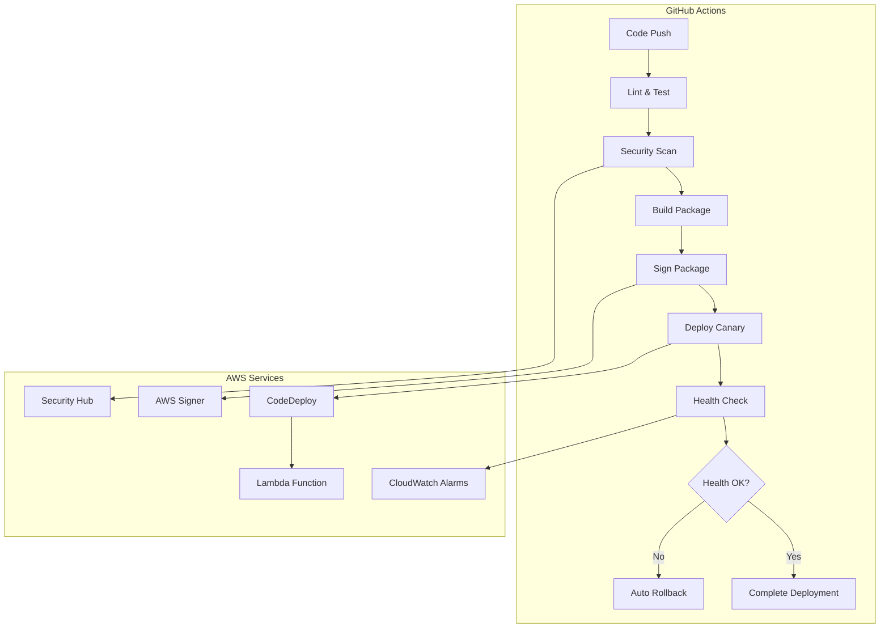

# Lambda Deployment Guide

This guide provides comprehensive instructions for deploying AWS Lambda functions using the production-ready CI/CD pipeline with canary deployments and automated rollback capabilities.

## Overview

The deployment system implements:

- **Automated CI/CD Pipeline**: GitHub Actions with OIDC authentication
- **Code Signing**: Mandatory AWS Signer integration for all deployments
- **Canary Deployments**: CodeDeploy with gradual traffic shifting
- **Health Monitoring**: CloudWatch alarms with automated rollback triggers
- **Security Scanning**: SAST, SCA, and policy validation with Security Hub integration
- **Rollback Automation**: Emergency and scheduled rollback capabilities

## Deployment Architecture



## Prerequisites

### Development and Testing Prerequisites

#### 1. GitHub Actions Workflow Testing

Before deploying to any environment, the GitHub Actions workflow must be thoroughly tested:

**Local Testing Setup**:
```bash
# Install act for local GitHub Actions testing
# macOS
brew install act

# Verify act installation
act --version

# Install Docker for act (if not already installed)
brew install docker
```

**Workflow Validation Requirements**:
```bash
# Test workflow syntax and structure
act --dryrun

# Test individual jobs locally
act -j lint-and-test
act -j security-scan
act -j build-and-package

# Test with different event triggers
act push
act pull_request
act workflow_dispatch
```

**Required GitHub Secrets for Testing**:
- `AWS_ACCOUNT_ID_STAGING`: AWS account ID for staging environment
- `AWS_ACCOUNT_ID_PROD`: AWS account ID for production environment

**GitHub Actions Testing Checklist**:
- [ ] Workflow syntax validation passes
- [ ] All jobs execute successfully in isolation
- [ ] OIDC authentication works with AWS
- [ ] Security scanning integrates with Security Hub
- [ ] Code signing process completes without errors
- [ ] Deployment artifacts are generated correctly
- [ ] Rollback procedures function as expected

#### 2. Terraform Infrastructure Testing

The deployment system requires Terraform infrastructure to be tested and validated:

**Terraform Setup Requirements**:
```bash
# Install Terraform
brew install terraform

# Install terraform-compliance for policy testing
pip install terraform-compliance

# Install Checkov for security scanning
pip install checkov

# Install TFLint for best practices
brew install tflint
```

**Infrastructure Testing Framework**:
```bash
# Create infrastructure directory structure
mkdir -p infrastructure/{environments/{staging,production},modules/{lambda,api-gateway,monitoring}}

# Initialize Terraform workspace
cd infrastructure
terraform init

# Validate Terraform configuration
terraform validate

# Run security and compliance checks
../docs/policies/ci-cd/validate-policies.sh ./infrastructure
```

**Required Terraform Infrastructure Components**:
- [ ] Lambda function definitions with code signing configuration
- [ ] CodeDeploy application and deployment groups
- [ ] CloudWatch alarms for monitoring and rollback triggers
- [ ] S3 buckets for deployment artifacts with versioning
- [ ] IAM roles and policies with permission boundaries
- [ ] AWS Config rules for compliance monitoring
- [ ] Security Hub integration for centralized findings

**Terraform Testing Checklist**:
- [ ] `terraform plan` executes without errors
- [ ] `terraform validate` passes for all modules
- [ ] Checkov security scans pass with no HIGH/CRITICAL findings
- [ ] terraform-compliance policy tests pass
- [ ] TFLint best practices validation passes
- [ ] Infrastructure can be deployed and destroyed cleanly
- [ ] State management and backend configuration is secure

#### 3. Integration Testing Prerequisites

**End-to-End Testing Setup**:
```bash
# Install testing dependencies
npm install --save-dev @aws-sdk/client-lambda @aws-sdk/client-codedeploy

# Set up test environment variables
export AWS_REGION=us-east-1
export LAMBDA_FUNCTION_NAME_STAGING=lambda-function-staging
export LAMBDA_FUNCTION_NAME_PROD=lambda-function-production
```

**Integration Test Requirements**:
```bash
# Run GitHub Actions and Terraform testing
./scripts/test-github-actions-terraform.sh

# This script will:
# - Validate GitHub Actions workflow syntax and configuration
# - Test Terraform infrastructure plans for staging and production
# - Verify policy validation tools and configurations
# - Test Lambda package build process
# - Generate comprehensive test report
```

**Integration Test Checklist**:
- [ ] GitHub Actions workflow syntax validation passes
- [ ] GitHub Actions workflow triggers correctly on code changes
- [ ] Terraform infrastructure validates and plans successfully
- [ ] Terraform infrastructure deploys successfully
- [ ] Lambda function deploys with proper code signing
- [ ] CodeDeploy canary deployment completes successfully
- [ ] CloudWatch alarms trigger rollback when appropriate
- [ ] Security Hub receives and processes scan results
- [ ] Manual rollback procedures work as expected
- [ ] Policy validation tools (Checkov, terraform-compliance) pass
- [ ] Lambda package builds without errors

#### 4. Pre-Deployment Validation

**Mandatory Validation Steps**:
```bash
# Run comprehensive validation suite
./scripts/validate-complete-integration.py

# Validate production readiness checklist
./scripts/validate-production-readiness.py

# Generate compliance evidence
./scripts/generate-checklist-evidence.py
```

**Validation Requirements**:
- [ ] All GitHub Actions workflow tests pass
- [ ] Terraform infrastructure tests pass
- [ ] Security scans show no blocking issues
- [ ] Permission boundaries are properly configured
- [ ] Code signing certificates are valid and not expired
- [ ] Monitoring and alerting systems are functional
- [ ] Rollback procedures have been tested successfully

### AWS Infrastructure Setup

#### 1. Lambda Function Configuration

```bash
# Create Lambda function
aws lambda create-function \
  --function-name lambda-function-staging \
  --runtime nodejs18.x \
  --role arn:aws:iam::ACCOUNT:role/lambda-execution-role \
  --handler index.handler \
  --zip-file fileb://initial-function.zip \
  --timeout 30 \
  --memory-size 256

# Create live alias
aws lambda create-alias \
  --function-name lambda-function-staging \
  --name live \
  --function-version 1
```

#### 2. Code Signing Setup

```bash
# Create signing profile
aws signer put-signing-profile \
  --profile-name lambda-staging \
  --signing-material certificateArn=arn:aws:acm::ACCOUNT:certificate/CERT-ID \
  --platform AWSLambda-SHA384-ECDSA

# Create code signing config
aws lambda create-code-signing-config \
  --allowed-publishers SigningProfileVersionArns=arn:aws:signer:REGION:ACCOUNT:signing-profiles/lambda-staging \
  --code-signing-policies UntrustedArtifactOnDeployment=Enforce

# Associate with Lambda function
aws lambda update-function-configuration \
  --function-name lambda-function-staging \
  --code-signing-config-arn arn:aws:lambda:REGION:ACCOUNT:code-signing-configs/CONFIG-ID
```

#### 3. CodeDeploy Application

```bash
# Create CodeDeploy application
aws deploy create-application \
  --application-name lambda-app-staging \
  --compute-platform Lambda

# Create deployment group
aws deploy create-deployment-group \
  --application-name lambda-app-staging \
  --deployment-group-name lambda-deployment-group \
  --service-role-arn arn:aws:iam::ACCOUNT:role/CodeDeployServiceRole \
  --deployment-config-name CodeDeployDefault.Lambda10PercentEvery5Minutes
```

#### 4. CloudWatch Alarms

```bash
# Error rate alarm
aws cloudwatch put-metric-alarm \
  --alarm-name lambda-error-rate-staging \
  --alarm-description "Lambda error rate too high" \
  --metric-name Errors \
  --namespace AWS/Lambda \
  --statistic Sum \
  --period 300 \
  --threshold 5 \
  --comparison-operator GreaterThanThreshold \
  --dimensions Name=FunctionName,Value=lambda-function-staging \
  --evaluation-periods 2

# Duration alarm
aws cloudwatch put-metric-alarm \
  --alarm-name lambda-duration-staging \
  --alarm-description "Lambda duration too high" \
  --metric-name Duration \
  --namespace AWS/Lambda \
  --statistic Average \
  --period 300 \
  --threshold 10000 \
  --comparison-operator GreaterThanThreshold \
  --dimensions Name=FunctionName,Value=lambda-function-staging \
  --evaluation-periods 2

# Throttle alarm
aws cloudwatch put-metric-alarm \
  --alarm-name lambda-throttle-staging \
  --alarm-description "Lambda throttles detected" \
  --metric-name Throttles \
  --namespace AWS/Lambda \
  --statistic Sum \
  --period 300 \
  --threshold 1 \
  --comparison-operator GreaterThanOrEqualToThreshold \
  --dimensions Name=FunctionName,Value=lambda-function-staging \
  --evaluation-periods 1
```

#### 5. S3 Bucket for Artifacts

```bash
# Create deployment bucket
aws s3 mb s3://lambda-artifacts-staging

# Enable versioning
aws s3api put-bucket-versioning \
  --bucket lambda-artifacts-staging \
  --versioning-configuration Status=Enabled

# Set lifecycle policy
aws s3api put-bucket-lifecycle-configuration \
  --bucket lambda-artifacts-staging \
  --lifecycle-configuration file://lifecycle-policy.json
```

### Terraform Infrastructure Setup

#### 1. Create Infrastructure Directory Structure

Before running the deployment, create the Terraform infrastructure:

```bash
# Create infrastructure directory structure
mkdir -p infrastructure/{environments/{staging,production},modules/{lambda,api-gateway,monitoring,security}}

# Create main Terraform files
cat > infrastructure/main.tf << 'EOF'
terraform {
  required_version = ">= 1.0"
  required_providers {
    aws = {
      source  = "hashicorp/aws"
      version = "~> 5.0"
    }
  }
}

provider "aws" {
  region = var.aws_region
  
  default_tags {
    tags = {
      Project     = "lambda-production-readiness"
      Environment = var.environment
      ManagedBy   = "terraform"
    }
  }
}
EOF

# Create variables file
cat > infrastructure/variables.tf << 'EOF'
variable "aws_region" {
  description = "AWS region for resources"
  type        = string
  default     = "us-east-1"
}

variable "environment" {
  description = "Environment name (staging/production)"
  type        = string
}

variable "lambda_function_name" {
  description = "Name of the Lambda function"
  type        = string
}
EOF
```

#### 2. Lambda Module Configuration

```bash
# Create Lambda module
cat > infrastructure/modules/lambda/main.tf << 'EOF'
resource "aws_lambda_function" "main" {
  function_name = var.function_name
  role         = aws_iam_role.lambda_execution.arn
  handler      = "index.handler"
  runtime      = "nodejs18.x"
  timeout      = 30
  memory_size  = 256
  
  filename         = var.deployment_package
  source_code_hash = filebase64sha256(var.deployment_package)
  
  code_signing_config_arn = aws_lambda_code_signing_config.main.arn
  
  tracing_config {
    mode = "Active"
  }
  
  environment {
    variables = var.environment_variables
  }
  
  dead_letter_config {
    target_arn = aws_sqs_queue.dlq.arn
  }
  
  reserved_concurrency = var.reserved_concurrency
  
  tags = var.tags
}

resource "aws_lambda_alias" "live" {
  name             = "live"
  description      = "Live alias for production traffic"
  function_name    = aws_lambda_function.main.function_name
  function_version = "$LATEST"
}
EOF
```

#### 3. Initialize and Validate Infrastructure

```bash
# Initialize Terraform
cd infrastructure
terraform init

# Create workspace for staging
terraform workspace new staging
terraform workspace new production

# Validate configuration
terraform validate

# Run policy validation
cd ..
./docs/policies/ci-cd/validate-policies.sh ./infrastructure
```

### GitHub Configuration

#### 1. Environment Setup

Create GitHub environments with the following configuration:

**Staging Environment**:
- Protection rules: 1 required reviewer
- Deployment branches: `develop`, `feature/*`
- Secrets: `AWS_ACCOUNT_ID_STAGING`

**Production Environment**:
- Protection rules: 2 required reviewers, 5-minute wait timer
- Deployment branches: `main` only
- Secrets: `AWS_ACCOUNT_ID_PROD`

#### 2. OIDC Provider Configuration

```bash
# Create OIDC provider in AWS
aws iam create-open-id-connect-provider \
  --url https://token.actions.githubusercontent.com \
  --thumbprint-list 6938fd4d98bab03faadb97b34396831e3780aea1 \
  --client-id-list sts.amazonaws.com
```

#### 3. IAM Roles for GitHub Actions

Create IAM roles with the trust policies defined in `.github/environments/` and attach the permission boundary from `docs/policies/iam-permission-boundary-cicd.json`.

## Pre-Deployment Testing

### GitHub Actions Workflow Testing

Before any deployment, validate the GitHub Actions workflow:

#### 1. Local Workflow Testing

```bash
# Test workflow syntax
act --dryrun

# Test lint and test job
act -j lint-and-test --secret-file .env.local

# Test security scanning (requires AWS credentials)
act -j security-scan --secret-file .env.local

# Test build and package job
act -j build-and-package --secret-file .env.local
```

#### 2. Branch-Based Testing

```bash
# Create test branch for workflow validation
git checkout -b test/workflow-validation

# Make a small change to trigger workflow
echo "# Workflow test" >> README.md
git add README.md
git commit -m "test: validate GitHub Actions workflow"

# Push to trigger workflow
git push origin test/workflow-validation

# Monitor workflow execution in GitHub Actions tab
# Verify all jobs complete successfully
```

#### 3. Terraform Infrastructure Testing

```bash
# Test Terraform configuration
cd infrastructure

# Select staging workspace
terraform workspace select staging

# Plan infrastructure deployment
terraform plan -var="environment=staging" -var="lambda_function_name=lambda-function-staging"

# Apply infrastructure (dry-run first)
terraform plan -out=tfplan
terraform show tfplan

# Run compliance validation
cd ..
./docs/policies/ci-cd/validate-policies.sh ./infrastructure

# Verify all policy checks pass before proceeding
```

### Integration Testing

#### 1. End-to-End Workflow Test

```bash
# Run complete integration test
./scripts/validate-complete-integration.py

# This script will:
# - Validate GitHub Actions workflow configuration
# - Test Terraform infrastructure deployment
# - Verify AWS resource creation
# - Test code signing and deployment process
# - Validate monitoring and rollback capabilities
```

#### 2. Security and Compliance Validation

```bash
# Run production readiness validation
./scripts/validate-production-readiness.py

# Generate compliance evidence
./scripts/generate-checklist-evidence.py

# Verify all checklist items are complete
```

## Deployment Process

### Automatic Deployments

#### Staging Deployment
Triggered automatically on:
- Push to `develop` branch
- Merge to `develop` branch

#### Production Deployment
Triggered automatically on:
- Push to `main` branch
- Requires manual approval (2 reviewers + 5-minute wait)

### Manual Deployments

#### Using GitHub Actions UI
1. Navigate to Actions tab in GitHub repository
2. Select "Lambda CI/CD Pipeline" workflow
3. Click "Run workflow"
4. Select target environment
5. Confirm deployment

#### Using CLI Tools

```bash
# Build package locally
./scripts/build-lambda-package.sh

# Validate package
./scripts/validate-lambda-package.sh -f lambda-function.zip -m full

# Sign package (requires AWS credentials)
./scripts/sign-lambda-package.sh \
  --file lambda-function.zip \
  --environment staging \
  --profile lambda-staging \
  --bucket lambda-artifacts-staging

# Deploy with canary
./scripts/deploy-lambda-canary.sh \
  --function lambda-function-staging \
  --environment staging \
  --package lambda-function-signed.zip
```

## Deployment Configurations

### CodeDeploy Configurations

| Configuration | Description | Traffic Shift |
|---------------|-------------|---------------|
| `CodeDeployDefault.LambdaCanary10Percent5Minutes` | 10% for 5 minutes, then 100% | Recommended for production |
| `CodeDeployDefault.LambdaCanary10Percent10Minutes` | 10% for 10 minutes, then 100% | Conservative production |
| `CodeDeployDefault.LambdaLinear10PercentEvery1Minute` | 10% every minute for 10 minutes | Gradual rollout |
| `CodeDeployDefault.LambdaAllAtOnce` | Immediate 100% | Emergency deployments only |

### Environment-Specific Settings

#### Staging Environment
- **Deployment Config**: `CodeDeployDefault.LambdaCanary10Percent5Minutes`
- **Health Check Timeout**: 5 minutes
- **Auto-rollback**: Enabled on alarms
- **Approval**: 1 reviewer required

#### Production Environment
- **Deployment Config**: `CodeDeployDefault.LambdaCanary10Percent10Minutes`
- **Health Check Timeout**: 10 minutes
- **Auto-rollback**: Enabled on alarms
- **Approval**: 2 reviewers + 5-minute wait

## Health Monitoring

### CloudWatch Alarms

The deployment system monitors the following metrics:

1. **Error Rate**: Triggers rollback if error rate > 5 errors in 5 minutes
2. **Duration**: Triggers rollback if average duration > 10 seconds
3. **Throttles**: Triggers rollback if any throttles detected

### Health Check Process

1. **Pre-deployment**: Validate package integrity and structure
2. **During deployment**: Monitor CodeDeploy deployment progress
3. **Post-deployment**: Check CloudWatch alarms for 10 minutes
4. **Continuous**: Monitor alarms and trigger rollback if needed

### Custom Health Checks

Add custom health checks by modifying the deployment script:

```bash
# Example: Custom API health check
check_api_health() {
    local endpoint="https://api.example.com/health"
    local response=$(curl -s -o /dev/null -w "%{http_code}" "$endpoint")
    
    if [ "$response" != "200" ]; then
        log_error "API health check failed: $response"
        return 1
    fi
    
    return 0
}
```

## Rollback Procedures

### Automatic Rollback

Automatic rollback is triggered by:
- CloudWatch alarm state changes to ALARM
- CodeDeploy deployment failures
- Health check failures during deployment

### Manual Rollback

#### Emergency Rollback (GitHub Actions)
1. Navigate to Actions tab
2. Select "Lambda CI/CD Pipeline" workflow
3. Click "Run workflow"
4. Select environment and enable rollback mode

#### CLI Rollback
```bash
# Emergency rollback to previous version
./scripts/rollback-lambda-deployment.sh \
  --function lambda-function-production \
  --environment production \
  --mode emergency \
  --force

# Manual rollback to specific version
./scripts/rollback-lambda-deployment.sh \
  --function lambda-function-production \
  --environment production \
  --version 5 \
  --mode manual
```

### Rollback Modes

1. **Auto**: Automatic rollback to previous version
2. **Manual**: Interactive rollback with confirmation
3. **Emergency**: Immediate rollback with minimal checks

## Security Features

### Code Signing Enforcement

All deployments must be signed with AWS Signer:
- Unsigned packages are automatically rejected
- Signature verification occurs before deployment
- Signing certificates must be valid and not expired

### Security Scanning Integration

The pipeline includes comprehensive security scanning:

1. **SAST (Static Application Security Testing)**:
   - CodeQL analysis for code vulnerabilities
   - Results integrated with Security Hub

2. **SCA (Software Composition Analysis)**:
   - npm audit for dependency vulnerabilities
   - Automated dependency updates via Dependabot

3. **Policy Validation**:
   - Checkov for infrastructure compliance
   - terraform-compliance for policy enforcement

### OIDC Authentication

No long-lived AWS access keys:
- GitHub OIDC provider integration
- Temporary credentials for all AWS operations
- Role-based access with permission boundaries

## Troubleshooting

### Common Issues

#### Deployment Failures

**Code Signing Failures**:
```bash
# Check signing profile status
aws signer get-signing-profile --profile-name lambda-staging

# Verify code signing config
aws lambda get-function --function-name lambda-function-staging \
  --query 'Configuration.CodeSigningConfigArn'
```

**CodeDeploy Failures**:
```bash
# Check deployment status
aws deploy get-deployment --deployment-id DEPLOYMENT-ID

# List recent deployments
aws deploy list-deployments --application-name lambda-app-staging
```

**Permission Issues**:
```bash
# Verify IAM role permissions
aws sts get-caller-identity

# Check permission boundary
aws iam get-role --role-name GitHubActions-Lambda-Staging
```

#### Health Check Failures

**CloudWatch Alarms**:
```bash
# Check alarm status
aws cloudwatch describe-alarms --alarm-names lambda-error-rate-staging

# View alarm history
aws cloudwatch describe-alarm-history --alarm-name lambda-error-rate-staging
```

**Function Errors**:
```bash
# View function logs
aws logs tail /aws/lambda/lambda-function-staging --follow

# Check function metrics
aws cloudwatch get-metric-statistics \
  --namespace AWS/Lambda \
  --metric-name Errors \
  --dimensions Name=FunctionName,Value=lambda-function-staging \
  --start-time 2023-01-01T00:00:00Z \
  --end-time 2023-01-01T01:00:00Z \
  --period 300 \
  --statistics Sum
```

### Debug Mode

Enable debug logging for detailed troubleshooting:

```bash
export DEBUG=true
./scripts/deploy-lambda-canary.sh --function lambda-function-staging
```

### Log Analysis

#### GitHub Actions Logs
- Detailed execution logs for each workflow step
- Artifact downloads for reports and manifests
- Error messages with context and suggestions

#### AWS CloudWatch Logs
- Lambda function execution logs with correlation IDs
- Structured JSON logging with AWS Lambda Powertools
- X-Ray tracing for end-to-end request tracking

#### Security Hub Findings
- Centralized security scan results
- Integration with CodeQL, npm audit, and Checkov
- Automated finding correlation and deduplication

## Best Practices

### Development Workflow

1. **Feature Development**:
   - Create feature branch from `develop`
   - Implement changes with tests
   - Run local validation before push

2. **Testing**:
   - Ensure 80%+ code coverage
   - Include integration tests
   - Validate against production-like data

3. **Security**:
   - Regular dependency updates
   - Security scan results review
   - Secrets management via AWS Secrets Manager

### Deployment Strategy

1. **Staging First**:
   - Always deploy to staging before production
   - Validate functionality and performance
   - Review security scan results

2. **Gradual Rollout**:
   - Use canary deployments for production
   - Monitor metrics during rollout
   - Be prepared for quick rollback

3. **Documentation**:
   - Update deployment notes
   - Document configuration changes
   - Maintain runbook procedures

### Monitoring and Alerting

1. **Proactive Monitoring**:
   - Set up comprehensive CloudWatch alarms
   - Monitor business metrics, not just technical metrics
   - Use distributed tracing for complex workflows

2. **Incident Response**:
   - Maintain up-to-date runbooks
   - Practice rollback procedures
   - Document lessons learned

3. **Performance Optimization**:
   - Regular performance reviews
   - Right-size Lambda memory and timeout
   - Optimize cold start performance

## Maintenance

### Regular Tasks

#### Weekly
- Review Security Hub findings
- Update dependencies via Dependabot PRs
- Check CloudWatch alarm thresholds

#### Monthly
- Rotate code signing certificates (if needed)
- Review and update IAM permissions
- Audit deployment logs and metrics

#### Quarterly
- Update Lambda runtime versions
- Review and update security policies
- Conduct disaster recovery testing

### Updates and Upgrades

#### Lambda Runtime Updates
```bash
# Update runtime version
aws lambda update-function-configuration \
  --function-name lambda-function-staging \
  --runtime nodejs20.x

# Test with canary deployment
./scripts/deploy-lambda-canary.sh \
  --function lambda-function-staging \
  --environment staging
```

#### Security Policy Updates
1. Update policies in `docs/policies/`
2. Test in staging environment
3. Deploy via infrastructure as code
4. Validate enforcement

#### CI/CD Pipeline Updates
1. Update workflow files in `.github/workflows/`
2. Test with feature branch deployment
3. Review security implications
4. Deploy to production after validation

## Support and Resources

### Documentation
- [AWS Lambda Developer Guide](https://docs.aws.amazon.com/lambda/)
- [AWS CodeDeploy User Guide](https://docs.aws.amazon.com/codedeploy/)
- [GitHub Actions Documentation](https://docs.github.com/en/actions)

### Monitoring Dashboards
- CloudWatch Lambda Insights
- AWS Security Hub Dashboard
- Custom CloudWatch Dashboards

### Contact Information
- **DevOps Team**: devops@company.com
- **Security Team**: security@company.com
- **On-Call**: Use PagerDuty escalation

### Emergency Procedures
1. **Production Outage**: Follow incident response runbook
2. **Security Incident**: Contact security team immediately
3. **Deployment Issues**: Use emergency rollback procedures