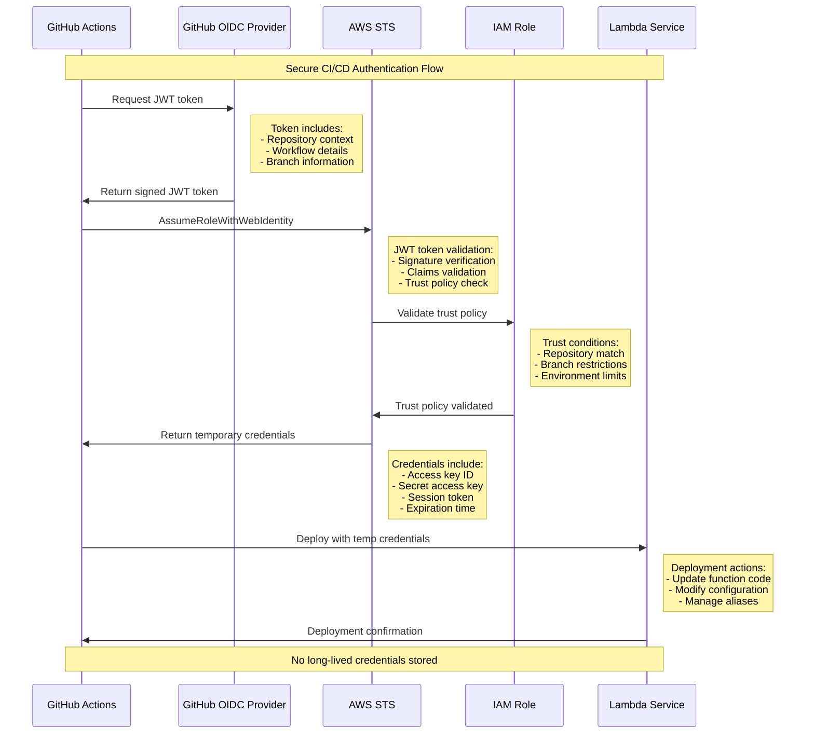
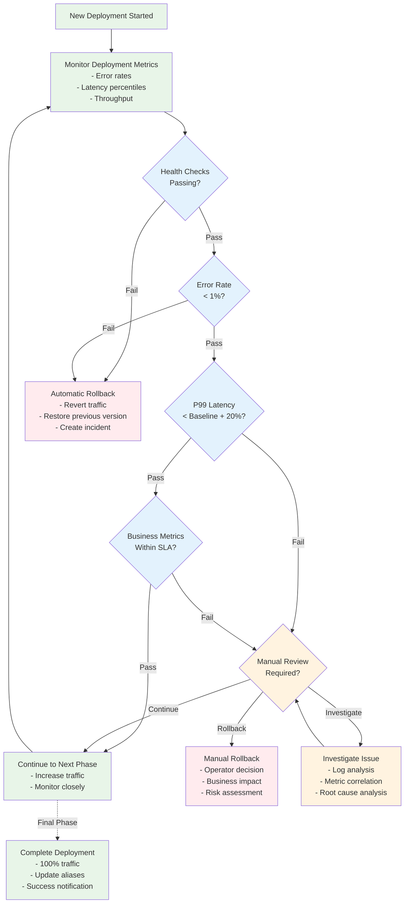

# CI/CD Pipeline Flow Architecture Diagrams

This document contains reference architecture diagrams showing CI/CD pipeline flows for Lambda deployments, including GitHub Actions, OIDC authentication, code signing, canary deployments, and Security Hub integration.

## 1. Complete CI/CD Pipeline Flow

```mermaid
graph TB
    subgraph "Developer Workflow"
        Dev[Developer]
        PR[Pull Request<br/>- Code changes<br/>- Tests included<br/>- Security review]
        Merge[Merge to Main<br/>- Approved PR<br/>- All checks passed]
    end
    
    subgraph "GitHub Actions Environment"
        Trigger[Workflow Trigger<br/>- Push to main<br/>- Manual dispatch<br/>- Schedule]
        
        subgraph "CI Pipeline Stages"
            Checkout[Checkout Code<br/>- Fetch repository<br/>- Setup Node.js<br/>- Cache dependencies]
            
            Lint[Lint & Format<br/>- ESLint checks<br/>- Prettier formatting<br/>- TypeScript compilation]
            
            Test[Unit & Integration Tests<br/>- Jest test runner<br/>- Coverage reporting<br/>- Test result artifacts]
            
            Security[Security Scanning<br/>- SAST with CodeQL<br/>- SCA with npm audit<br/>- Dependency scanning]
        end
        
        subgraph "Build & Package"
            Build[Build Application<br/>- Bundle optimization<br/>- Environment config<br/>- Asset compilation]
            
            Package[Package Lambda<br/>- ZIP creation<br/>- Layer packaging<br/>- Artifact validation]
        end
    end
    
    subgraph "AWS Authentication"
        OIDC[GitHub OIDC Provider<br/>- JWT token exchange<br/>- No long-lived keys<br/>- Temporary credentials]
        
        IAMRole[CI/CD IAM Role<br/>- Permission boundary<br/>- Least privilege access<br/>- Environment-specific]
        
        STS[AWS STS<br/>- Assume role<br/>- Temporary credentials<br/>- Session management]
    end
    
    subgraph "AWS Deployment Environment"
        subgraph "Code Signing"
            Signer[AWS Signer<br/>- Code signing profile<br/>- Digital signature<br/>- Integrity verification]
            
            SignedArtifact[Signed Artifact<br/>- Cryptographic signature<br/>- Tamper detection<br/>- Audit trail]
        end
        
        subgraph "Deployment Strategy"
            S3Deploy[S3 Deployment Bucket<br/>- Versioned artifacts<br/>- Encryption at rest<br/>- Access logging]
            
            CodeDeploy[AWS CodeDeploy<br/>- Canary deployment<br/>- Traffic shifting<br/>- Rollback capability]
            
            Lambda[Lambda Function<br/>- Version creation<br/>- Alias management<br/>- Configuration updates]
        end
    end
    
    subgraph "Monitoring & Validation"
        HealthCheck[Health Checks<br/>- Synthetic monitoring<br/>- API validation<br/>- Performance testing]
        
        Alarms[CloudWatch Alarms<br/>- Error rate monitoring<br/>- Latency thresholds<br/>- Success metrics]
        
        Rollback[Automated Rollback<br/>- Alarm-triggered<br/>- Traffic restoration<br/>- Incident creation]
    end
    
    subgraph "Security & Compliance"
        SecurityHub[AWS Security Hub<br/>- Scan result aggregation<br/>- Compliance tracking<br/>- Finding correlation]
        
        Audit[Audit Trail<br/>- CloudTrail events<br/>- Deployment history<br/>- Change tracking]
        
        Compliance[Compliance Validation<br/>- Policy enforcement<br/>- Control verification<br/>- Evidence collection]
    end
    
    %% Workflow Flow
    Dev --> PR
    PR --> Merge
    Merge --> Trigger
    
    %% CI Pipeline
    Trigger --> Checkout
    Checkout --> Lint
    Lint --> Test
    Test --> Security
    Security --> Build
    Build --> Package
    
    %% Authentication Flow
    Package --> OIDC
    OIDC --> IAMRole
    IAMRole --> STS
    
    %% Deployment Flow
    STS --> Signer
    Package --> Signer
    Signer --> SignedArtifact
    SignedArtifact --> S3Deploy
    S3Deploy --> CodeDeploy
    CodeDeploy --> Lambda
    
    %% Monitoring Flow
    Lambda --> HealthCheck
    HealthCheck --> Alarms
    Alarms -.->|Failure detected| Rollback
    Rollback -.->|Restore previous| Lambda
    
    %% Security Integration
    Security --> SecurityHub
    Signer --> Audit
    CodeDeploy --> Audit
    Lambda --> Compliance
    
    %% Styling
    classDef developer fill:#e8f5e8
    classDef ci fill:#e3f2fd
    classDef auth fill:#fff3e0
    classDef deploy fill:#f3e5f5
    classDef monitor fill:#ffebee
    classDef security fill:#fce4ec
    
    class Dev,PR,Merge developer
    class Trigger,Checkout,Lint,Test,Security,Build,Package ci
    class OIDC,IAMRole,STS auth
    class Signer,SignedArtifact,S3Deploy,CodeDeploy,Lambda deploy
    class HealthCheck,Alarms,Rollback monitor
    class SecurityHub,Audit,Compliance security
```



## 2. CodeDeploy Canary Deployment Process

```mermaid
graph TB
    subgraph "Pre-Deployment"
        Artifact[Signed Lambda Artifact<br/>- Code signature verified<br/>- Security scans passed<br/>- Build artifacts ready]
        
        Config[Deployment Configuration<br/>- Canary percentage<br/>- Traffic shift duration<br/>- Rollback triggers]
        
        Baseline[Baseline Metrics<br/>- Current error rates<br/>- Performance baselines<br/>- Health check status]
    end
    
    subgraph "Lambda Version Management"
        CurrentVersion[Current Version ($LATEST)<br/>- Production traffic<br/>- Stable performance<br/>- Known good state]
        
        NewVersion[New Version (v2)<br/>- Updated code<br/>- New configuration<br/>- Ready for testing]
        
        subgraph "Alias Management"
            ProdAlias[PROD Alias<br/>- 100% → Current Version<br/>- Production traffic<br/>- Blue environment]
            
            CanaryAlias[CANARY Alias<br/>- 10% → New Version<br/>- 90% → Current Version<br/>- Green environment]
        end
    end
    
    subgraph "Traffic Shifting Phases"
        Phase1[Phase 1: Initial Canary<br/>- 10% traffic to new version<br/>- 5 minute observation<br/>- Health check validation]
        
        Phase2[Phase 2: Gradual Shift<br/>- 25% traffic to new version<br/>- 10 minute observation<br/>- Performance monitoring]
        
        Phase3[Phase 3: Majority Shift<br/>- 50% traffic to new version<br/>- 15 minute observation<br/>- Error rate analysis]
        
        Phase4[Phase 4: Full Deployment<br/>- 100% traffic to new version<br/>- Update PROD alias<br/>- Complete deployment]
    end
    
    subgraph "Monitoring & Validation"
        Metrics[Real-time Metrics<br/>- Invocation count<br/>- Error rates<br/>- Duration percentiles]
        
        Alarms[Deployment Alarms<br/>- Error rate > 1%<br/>- Duration > P99 baseline<br/>- Throttle detection]
        
        HealthChecks[Health Checks<br/>- Synthetic transactions<br/>- API endpoint validation<br/>- Dependency checks]
    end
    
    subgraph "Rollback Scenarios"
        AutoRollback[Automatic Rollback<br/>- Alarm threshold breached<br/>- Health check failures<br/>- Performance degradation]
        
        ManualRollback[Manual Rollback<br/>- Operator intervention<br/>- Business impact detected<br/>- Emergency procedures]
        
        RollbackAction[Rollback Execution<br/>- Revert alias weights<br/>- Restore previous version<br/>- Incident notification]
    end
    
    subgraph "Post-Deployment"
        Validation[Post-Deploy Validation<br/>- End-to-end testing<br/>- Performance verification<br/>- Business metric validation]
        
        Cleanup[Version Cleanup<br/>- Remove old versions<br/>- Update documentation<br/>- Archive artifacts]
        
        Notification[Success Notification<br/>- Deployment complete<br/>- Stakeholder updates<br/>- Metrics dashboard]
    end
    
    %% Deployment Flow
    Artifact --> NewVersion
    Config --> CanaryAlias
    Baseline --> Phase1
    
    CurrentVersion --> ProdAlias
    NewVersion --> CanaryAlias
    
    %% Traffic Shifting
    Phase1 --> Phase2
    Phase2 --> Phase3
    Phase3 --> Phase4
    
    %% Monitoring
    Phase1 --> Metrics
    Phase2 --> Metrics
    Phase3 --> Metrics
    Phase4 --> Metrics
    
    Metrics --> Alarms
    Metrics --> HealthChecks
    
    %% Rollback Triggers
    Alarms -.->|Threshold breached| AutoRollback
    HealthChecks -.->|Validation failed| AutoRollback
    Phase1 -.->|Manual decision| ManualRollback
    Phase2 -.->|Manual decision| ManualRollback
    Phase3 -.->|Manual decision| ManualRollback
    
    AutoRollback --> RollbackAction
    ManualRollback --> RollbackAction
    RollbackAction -.->|Restore| ProdAlias
    
    %% Success Path
    Phase4 --> Validation
    Validation --> Cleanup
    Cleanup --> Notification
    
    %% Styling
    classDef preDeployment fill:#e8f5e8
    classDef versionMgmt fill:#e3f2fd
    classDef trafficShift fill:#fff3e0
    classDef monitoring fill:#f3e5f5
    classDef rollback fill:#ffebee
    classDef postDeploy fill:#f1f8e9
    
    class Artifact,Config,Baseline preDeployment
    class CurrentVersion,NewVersion,ProdAlias,CanaryAlias versionMgmt
    class Phase1,Phase2,Phase3,Phase4 trafficShift
    class Metrics,Alarms,HealthChecks monitoring
    class AutoRollback,ManualRollback,RollbackAction rollback
    class Validation,Cleanup,Notification postDeploy
```

## 3. Security Hub Integration and Compliance Flow

```mermaid
graph TB
    subgraph "CI/CD Security Scanning"
        SAST[SAST Scanning<br/>- CodeQL analysis<br/>- Vulnerability detection<br/>- Code quality checks]
        
        SCA[SCA Scanning<br/>- Dependency analysis<br/>- License compliance<br/>- Vulnerability assessment]
        
        IaC[IaC Policy Scanning<br/>- Checkov validation<br/>- terraform-compliance<br/>- Security best practices]
        
        Container[Container Scanning<br/>- Base image vulnerabilities<br/>- Configuration issues<br/>- Runtime security]
    end
    
    subgraph "AWS Security Services"
        Inspector[Amazon Inspector<br/>- Runtime vulnerability assessment<br/>- Network reachability analysis<br/>- Security findings]
        
        GuardDuty[Amazon GuardDuty<br/>- Threat detection<br/>- Malicious activity monitoring<br/>- Behavioral analysis]
        
        Config[AWS Config<br/>- Configuration compliance<br/>- Rule evaluation<br/>- Drift detection]
        
        CloudTrail[AWS CloudTrail<br/>- API activity logging<br/>- Audit trail<br/>- Compliance evidence]
    end
    
    subgraph "Security Hub Aggregation"
        SecurityHub[AWS Security Hub<br/>- Central security dashboard<br/>- Finding aggregation<br/>- Compliance scoring]
        
        subgraph "Finding Categories"
            Critical[Critical Findings<br/>- Immediate action required<br/>- Deployment blocking<br/>- Security incidents]
            
            High[High Findings<br/>- Urgent remediation<br/>- Risk assessment<br/>- Mitigation planning]
            
            Medium[Medium Findings<br/>- Scheduled remediation<br/>- Risk acceptance<br/>- Monitoring required]
            
            Low[Low Findings<br/>- Best practice improvements<br/>- Technical debt<br/>- Future enhancements]
        end
    end
    
    subgraph "Compliance Frameworks"
        ISO27001[ISO 27001<br/>- Information security controls<br/>- Risk management<br/>- Continuous improvement]
        
        SOC2[SOC 2 Type II<br/>- Security controls<br/>- Availability controls<br/>- Processing integrity]
        
        NIST[NIST Cybersecurity Framework<br/>- Identify, Protect, Detect<br/>- Respond, Recover<br/>- Risk-based approach]
        
        PCI[PCI DSS<br/>- Payment card security<br/>- Data protection<br/>- Network security]
    end
    
    subgraph "Automated Response"
        BlockDeploy[Block Deployment<br/>- Critical/High findings<br/>- Policy violations<br/>- Security gate failure]
        
        CreateTicket[Create Remediation Ticket<br/>- Jira integration<br/>- Assignment routing<br/>- SLA tracking]
        
        Notification[Security Notifications<br/>- Slack alerts<br/>- Email notifications<br/>- Dashboard updates]
        
        Quarantine[Quarantine Resources<br/>- Isolate affected systems<br/>- Prevent lateral movement<br/>- Incident response]
    end
    
    subgraph "Reporting & Dashboards"
        ExecutiveDash[Executive Dashboard<br/>- Security posture overview<br/>- Trend analysis<br/>- Risk metrics]
        
        ComplianceDash[Compliance Dashboard<br/>- Framework alignment<br/>- Control effectiveness<br/>- Audit readiness]
        
        OperationalDash[Operational Dashboard<br/>- Real-time findings<br/>- Remediation status<br/>- Team performance]
        
        AuditReport[Audit Reports<br/>- Evidence collection<br/>- Control testing<br/>- Compliance attestation]
    end
    
    %% Security Scanning Flow
    SAST --> SecurityHub
    SCA --> SecurityHub
    IaC --> SecurityHub
    Container --> SecurityHub
    
    %% AWS Security Services Flow
    Inspector --> SecurityHub
    GuardDuty --> SecurityHub
    Config --> SecurityHub
    CloudTrail --> SecurityHub
    
    %% Finding Classification
    SecurityHub --> Critical
    SecurityHub --> High
    SecurityHub --> Medium
    SecurityHub --> Low
    
    %% Compliance Mapping
    SecurityHub --> ISO27001
    SecurityHub --> SOC2
    SecurityHub --> NIST
    SecurityHub --> PCI
    
    %% Automated Response
    Critical --> BlockDeploy
    High --> CreateTicket
    Medium --> Notification
    Low --> Notification
    
    Critical --> Quarantine
    High --> Quarantine
    
    %% Reporting
    SecurityHub --> ExecutiveDash
    SecurityHub --> ComplianceDash
    SecurityHub --> OperationalDash
    SecurityHub --> AuditReport
    
    %% Styling
    classDef scanning fill:#ffebee
    classDef awsServices fill:#e3f2fd
    classDef securityHub fill:#f3e5f5
    classDef compliance fill:#e8f5e8
    classDef response fill:#fff3e0
    classDef reporting fill:#fce4ec
    
    class SAST,SCA,IaC,Container scanning
    class Inspector,GuardDuty,Config,CloudTrail awsServices
    class SecurityHub,Critical,High,Medium,Low securityHub
    class ISO27001,SOC2,NIST,PCI compliance
    class BlockDeploy,CreateTicket,Notification,Quarantine response
    class ExecutiveDash,ComplianceDash,OperationalDash,AuditReport reporting
```



## 4. GitHub OIDC Authentication Flow



## 5. Rollback Decision Tree



## Key Integration Points

### OIDC Authentication Benefits
1. **No Long-lived Credentials**: Eliminates the risk of credential exposure
2. **Fine-grained Access Control**: Repository and branch-specific permissions
3. **Audit Trail**: Complete visibility into authentication events
4. **Automatic Rotation**: Temporary credentials with short expiration

### Code Signing Integration
1. **Mandatory Signing**: All Lambda deployments must be signed
2. **Signature Verification**: Runtime verification of code integrity
3. **Audit Trail**: Complete signing history and verification logs
4. **Tamper Detection**: Immediate detection of unauthorized code changes

### Security Hub Integration
1. **Centralized Findings**: All security scan results in one location
2. **Compliance Mapping**: Automatic mapping to regulatory frameworks
3. **Automated Response**: Policy-driven response to security findings
4. **Audit Readiness**: Complete evidence collection for compliance audits

### Canary Deployment Strategy
1. **Risk Mitigation**: Gradual traffic shifting reduces blast radius
2. **Automated Monitoring**: Real-time health checks and performance monitoring
3. **Quick Rollback**: Immediate restoration of previous version on issues
4. **Business Continuity**: Minimal impact on production operations