# Lambda Request Flow Architecture Diagrams

This document contains reference architecture diagrams showing Lambda request flows, security boundaries, encryption points, and monitoring touchpoints for production-ready serverless applications.

## 1. API Gateway + Lambda Request Flow

## 2. EventBridge + Lambda Event-Driven Flow

```mermaid
graph TB
    subgraph "Event Sources"
        S3Event[S3 Event<br/>- Object created/deleted<br/>- Encrypted notification]
        Schedule[EventBridge Schedule<br/>- Cron expressions<br/>- Rate expressions]
        Custom[Custom Application<br/>- Business events<br/>- API calls]
    end
    
    subgraph "Event Processing"
        EB[EventBridge<br/>- Event filtering<br/>- Content-based routing<br/>- Archive & replay]
        
        subgraph "Event Rules"
            Rule1[Rule: S3 Events<br/>- Pattern matching<br/>- Target routing]
            Rule2[Rule: Scheduled Events<br/>- Time-based triggers]
            Rule3[Rule: Custom Events<br/>- Business logic routing]
        end
    end
    
    subgraph "VPC Lambda Environment"
        Lambda1[Processing Lambda<br/>- Idempotent processing<br/>- X-Ray tracing<br/>- Powertools logging]
        Lambda2[Batch Lambda<br/>- Scheduled processing<br/>- Concurrency limits]
        Lambda3[Workflow Lambda<br/>- State management<br/>- Error handling]
    end
    
    subgraph "Downstream Processing"
        SQS[SQS Queue<br/>- FIFO ordering<br/>- Visibility timeout<br/>- DLQ configured]
        SNS[SNS Topic<br/>- Fan-out pattern<br/>- Encryption in transit]
        SF[Step Functions<br/>- Workflow orchestration<br/>- Error retry logic]
    end
    
    subgraph "Error Handling & DLQ"
        DLQ1[Lambda DLQ<br/>- Failed invocations<br/>- Manual inspection]
        DLQ2[SQS DLQ<br/>- Poison messages<br/>- Redrive policy]
        Alarm[CloudWatch Alarms<br/>- DLQ depth monitoring<br/>- Error rate alerts]
    end
    
    subgraph "Monitoring & Observability"
        CWLogs[CloudWatch Logs<br/>- Structured logging<br/>- Log insights queries]
        CWMetrics[CloudWatch Metrics<br/>- Custom metrics<br/>- Business KPIs]
        XRayTrace[X-Ray Tracing<br/>- End-to-end visibility<br/>- Performance analysis]
    end
    
    %% Event Flow
    S3Event --> EB
    Schedule --> EB
    Custom --> EB
    
    EB --> Rule1
    EB --> Rule2  
    EB --> Rule3
    
    Rule1 --> Lambda1
    Rule2 --> Lambda2
    Rule3 --> Lambda3
    
    %% Downstream Processing
    Lambda1 --> SQS
    Lambda2 --> SNS
    Lambda3 --> SF
    
    %% Error Handling
    Lambda1 -.->|On failure| DLQ1
    SQS -.->|Poison messages| DLQ2
    DLQ1 --> Alarm
    DLQ2 --> Alarm
    
    %% Monitoring
    Lambda1 --> CWLogs
    Lambda2 --> CWLogs
    Lambda3 --> CWLogs
    
    Lambda1 --> CWMetrics
    Lambda2 --> CWMetrics
    Lambda3 --> CWMetrics
    
    Lambda1 --> XRayTrace
    Lambda2 --> XRayTrace
    Lambda3 --> XRayTrace
    
    %% Styling
    classDef eventSource fill:#e1f5fe
    classDef processing fill:#f3e5f5
    classDef errorHandling fill:#ffebee
    classDef monitoring fill:#e8f5e8
    
    class S3Event,Schedule,Custom eventSource
    class EB,Rule1,Rule2,Rule3,Lambda1,Lambda2,Lambda3 processing
    class DLQ1,DLQ2,Alarm errorHandling
    class CWLogs,CWMetrics,XRayTrace monitoring
```

## 3. SQS + Lambda Batch Processing Flow

## Security Boundaries and Encryption Points

### Network Security Boundaries
1. **Internet Boundary**: AWS WAF provides the first line of defense
2. **VPC Boundary**: Lambda functions execute within VPC for private resource access
3. **Subnet Isolation**: Private subnets for Lambda, public subnets for NAT Gateway (if needed)
4. **Security Groups**: Restrictive ingress/egress rules for Lambda ENIs

### Encryption Points
1. **Data in Transit**:
   - TLS 1.2+ for all external communications
   - VPC endpoints for AWS service communication
   - Encrypted connections to external APIs

2. **Data at Rest**:
   - Lambda environment variables encrypted with KMS
   - DynamoDB encryption at rest with customer-managed keys
   - S3 server-side encryption with KMS
   - Secrets Manager automatic encryption

3. **Application Layer**:
   - JWT token encryption for API authentication
   - Message payload encryption for sensitive data
   - Database field-level encryption for PII

### Monitoring Touchpoints
1. **Request Tracing**: X-Ray distributed tracing across all components
2. **Structured Logging**: Lambda Powertools for consistent log format
3. **Metrics Collection**: Custom CloudWatch metrics for business KPIs
4. **Security Monitoring**: Security Hub integration for compliance tracking
5. **Operational Dashboards**: Real-time visibility into system health

## DLQ and Destination Routing Patterns

### Dead Letter Queue Configuration
- **SQS DLQ**: For failed message processing with configurable redrive policy
- **Lambda DLQ**: For failed function invocations with manual inspection capability
- **EventBridge DLQ**: For failed event delivery with replay functionality

### Lambda Destinations
- **Success Destinations**: Route successful invocation results to downstream systems
- **Failure Destinations**: Route failed invocations to error handling systems
- **Asynchronous Processing**: Decouple success/failure handling from main processing logic

### Message Replay Strategies
- **Batch Redrive**: Replay all messages from DLQ to main queue
- **Individual Retry**: Selective message replay based on error analysis
- **Circuit Breaker**: Prevent cascade failures during downstream system issues