# Incident Flow Diagrams

## Overview

This document contains Mermaid diagrams for Lambda incident response flows, escalation paths, and troubleshooting decision trees. These interactive diagrams guide on-call engineers through systematic incident resolution procedures.

## 5XX Error Incident Response Flow

### Decision Tree for 5XX Error Investigation

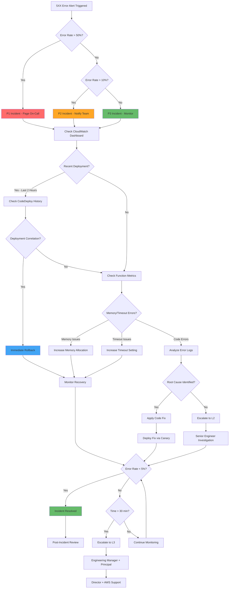

### 5XX Error Response Timeline

```mermaid
gantt
    title Lambda 5XX Error Incident Response Timeline
    dateFormat X
    axisFormat %M:%S
    
    section Detection
    Alert Triggered           :milestone, m1, 0, 0m
    
    section Assessment (0-5min)
    Check Dashboard          :active, a1, 0, 2m
    Identify Pattern         :a2, after a1, 2m
    Classify Severity        :a3, after a2, 1m
    
    section Investigation (5-15min)
    Check Deployments        :b1, after a3, 3m
    Analyze Logs            :b2, after b1, 4m
    Review X-Ray Traces     :b3, after b2, 3m
    
    section Mitigation (15-30min)
    Apply Fix               :crit, c1, after b3, 5m
    Monitor Recovery        :c2, after c1, 10m
    
    section Escalation Points
    L2 Escalation (15min)   :milestone, e1, 15, 0m
    L3 Escalation (30min)   :milestone, e2, 30, 0m
    L4 Escalation (60min)   :milestone, e3, 60, 0m
```

## Throttling Incident Response Flow

### Throttling Investigation Decision Tree

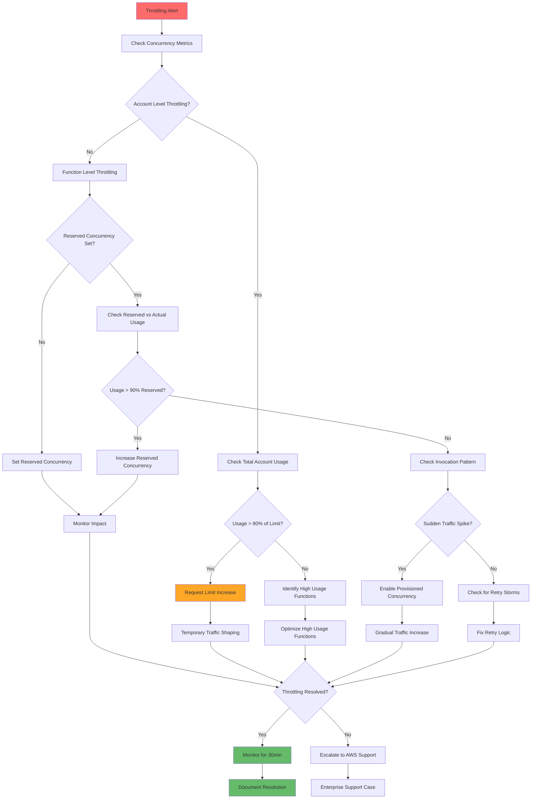

## SQS/DLQ Troubleshooting Flow

### Poisoned Message Investigation

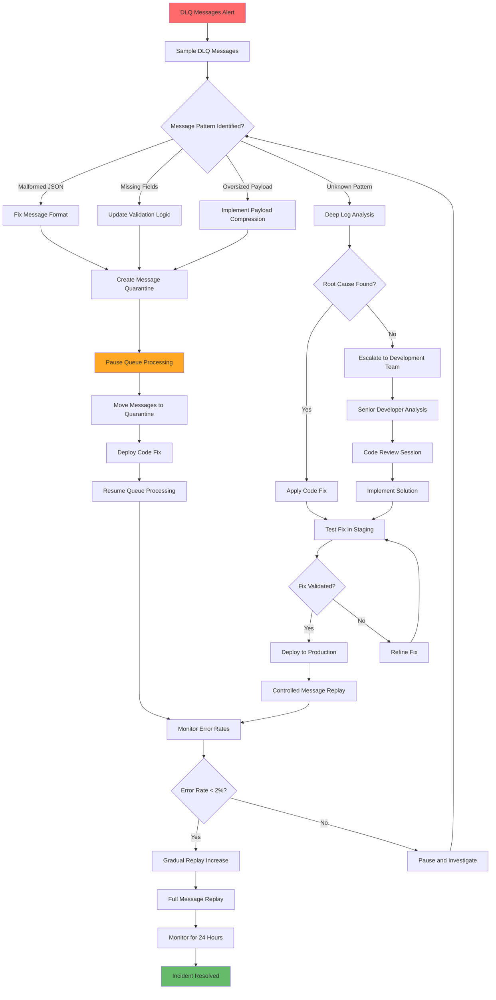

### Message Replay Strategy

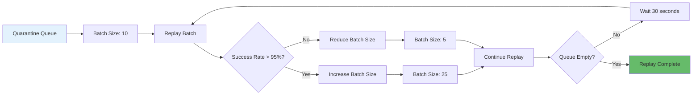

## Escalation Path Flowchart

### Incident Escalation Matrix

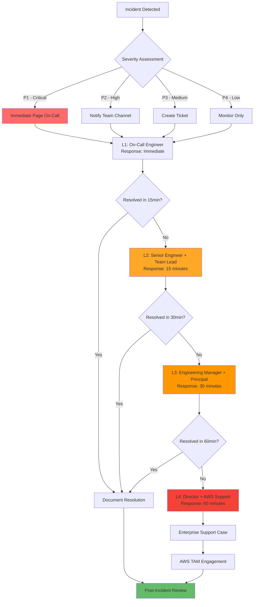

### Communication Timeline

```mermaid
gantt
    title Incident Communication Timeline
    dateFormat X
    axisFormat %H:%M
    
    section L1 Response
    Initial Assessment    :active, l1a, 0, 15m
    Status Update 1      :milestone, s1, 15, 0m
    
    section L2 Escalation
    Senior Engineer      :l2a, 15, 30m
    Status Update 2      :milestone, s2, 30, 0m
    
    section L3 Escalation
    Management Involved  :crit, l3a, 30, 60m
    Status Update 3      :milestone, s3, 60, 0m
    
    section L4 Escalation
    Director + AWS       :crit, l4a, 60, 120m
    Final Resolution     :milestone, s4, 120, 0m
```

## Secret Rotation Flow

### Automated Secret Rotation Process

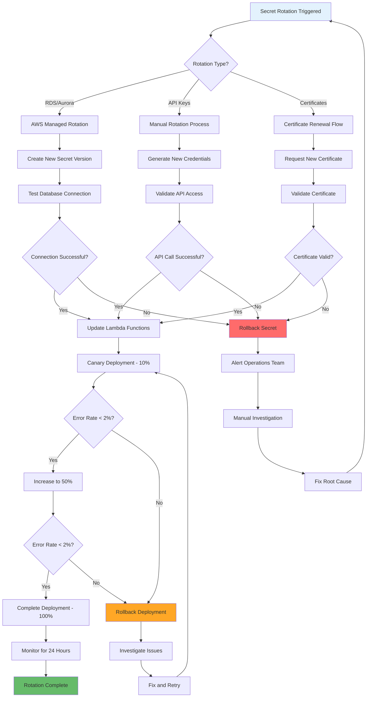

## Runtime Upgrade Decision Flow

### Runtime Upgrade Assessment

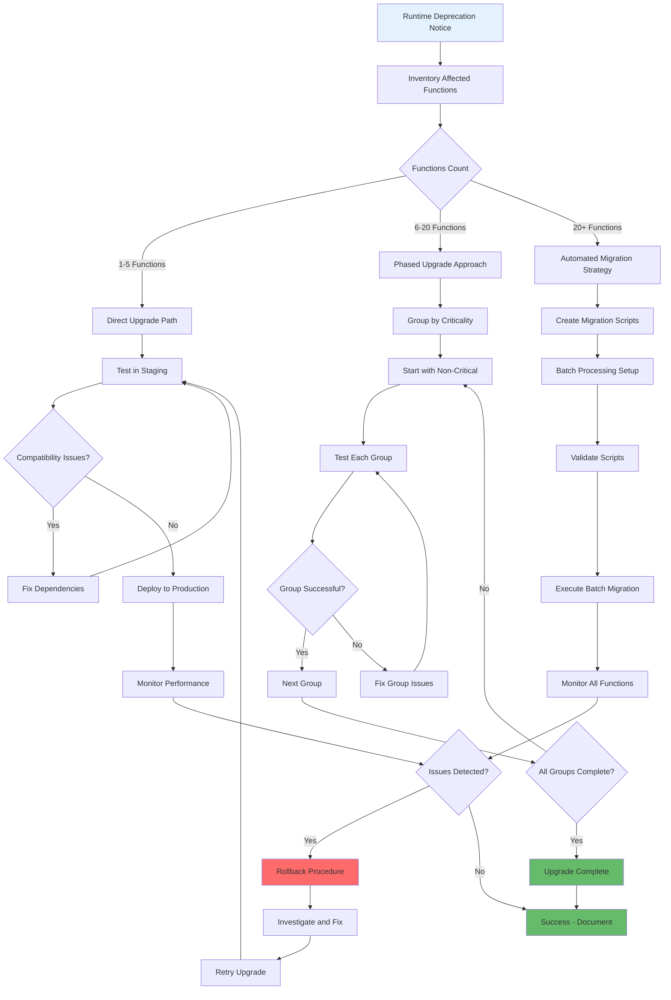

## Interactive Troubleshooting Guide

### Lambda Performance Issues

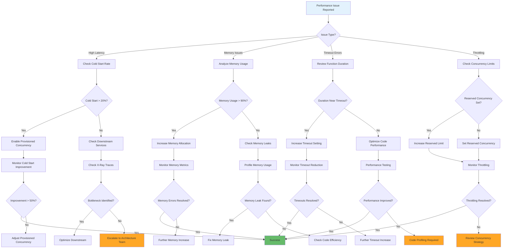

## Monitoring Dashboard Flow

### Real-time Incident Dashboard Navigation

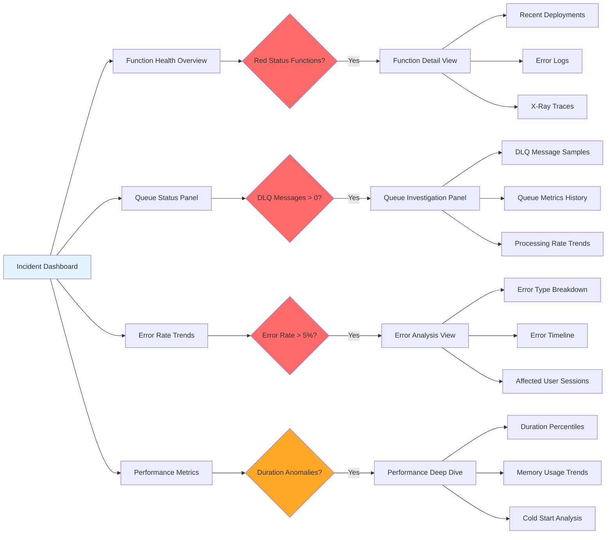

## Quick Action Decision Matrix

### Immediate Response Actions

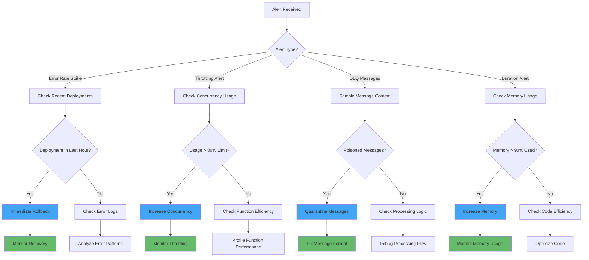

These diagrams provide visual guidance for incident response procedures and can be embedded in monitoring dashboards or incident management tools for quick reference during production issues.