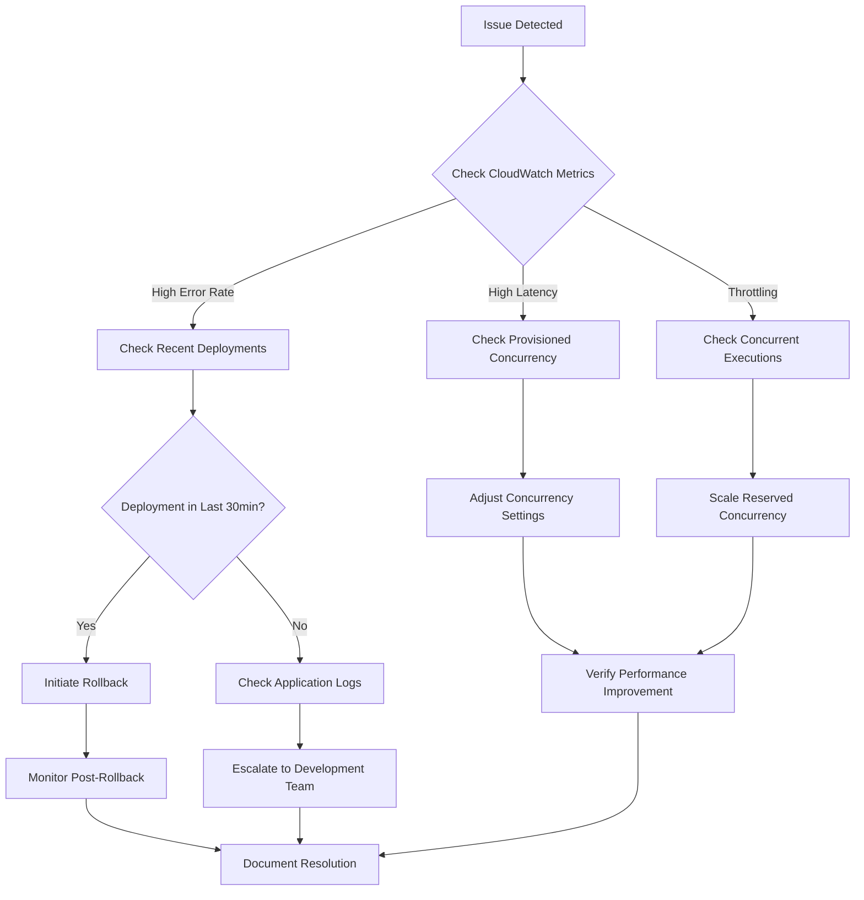

# [Runbook Title] - Operational Procedure

## Document Information

| Field | Value |
|-------|-------|
| Document Type | Operational Runbook |
| Version | 1.0 |
| Last Updated | [Date] |
| Owner | [Operations Team] |
| On-Call Escalation | [Contact information] |
| Severity Level | [P1/P2/P3/P4] |

## Overview

### Scenario Description
[When to use this runbook - specific symptoms or conditions]

### Expected Duration
[Estimated time to complete procedure]

### Prerequisites
- [ ] Access to AWS Console with appropriate permissions
- [ ] Access to monitoring dashboards
- [ ] On-call escalation contacts available
- [ ] [Other specific prerequisites]

## Procedure Steps

### Step 1: Initial Assessment
**Objective**: [What this step accomplishes]

**Actions**:
1. [Specific action with expected outcome]
   ```bash
   # Example command
   aws lambda get-function --function-name [function-name]
   ```
   **Expected Result**: [What you should see]

2. [Next action]
   **Expected Result**: [What you should see]

**Troubleshooting**:
- If [condition], then [action]
- If [condition], escalate to [team/person]

### Step 2: [Next Major Step]
**Objective**: [What this step accomplishes]

**Actions**:
1. [Specific action]
2. [Specific action]

**Validation**:
- [ ] [Checkpoint 1]
- [ ] [Checkpoint 2]

### Step 3: Resolution Verification
**Objective**: Confirm the issue is resolved

**Actions**:
1. Monitor key metrics for [time period]
2. Verify [specific conditions]
3. Update incident ticket with resolution

**Success Criteria**:
- [ ] [Metric 1] returns to normal levels
- [ ] [Metric 2] shows expected behavior
- [ ] No new related alerts triggered

## Decision Tree



## Escalation Procedures

### Level 1 - Operations Team
- **When**: Standard operational issues
- **Contact**: [Team contact info]
- **SLA**: 15 minutes response

### Level 2 - Development Team
- **When**: Application-specific issues, code problems
- **Contact**: [Team contact info]
- **SLA**: 30 minutes response

### Level 3 - Architecture Team
- **When**: Infrastructure or design issues
- **Contact**: [Team contact info]
- **SLA**: 1 hour response

## Post-Incident Actions

1. **Document Resolution**:
   - Update incident ticket with root cause
   - Record resolution steps taken
   - Note any deviations from this runbook

2. **Review and Improve**:
   - Schedule post-incident review if P1/P2
   - Update runbook if new steps discovered
   - Update monitoring/alerting if gaps identified

3. **Communication**:
   - Notify stakeholders of resolution
   - Update status page if customer-facing
   - Send summary to management if required

## Related Documents

- [Link to related runbooks]
- [Link to monitoring dashboards]
- [Link to escalation procedures]
- [Link to system architecture diagrams]

## Monitoring and Metrics

### Key Metrics to Monitor
- [Metric 1]: [Normal range/threshold]
- [Metric 2]: [Normal range/threshold]
- [Metric 3]: [Normal range/threshold]

### Dashboard Links
- [CloudWatch Dashboard URL]
- [X-Ray Service Map URL]
- [Custom Dashboard URL]

---

**Runbook Maintenance**
- Review quarterly or after major incidents
- Test procedures in non-production environment
- Update contact information as needed
- Version control all changes